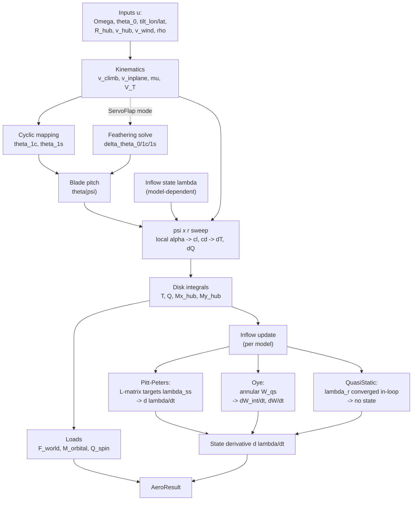

# Mathematical Model Reference

This document describes the aerodynamic models implemented in `dynbem_rs/`.
The architecture is a blade-element momentum (BEM) solver with replaceable
dynamic-inflow sub-models, all sharing a common azimuth-radial sweep kernel.

---

## System Overview

The model is a map from rotor inputs and the current inflow state to the
aerodynamic loads and the time-derivative of the inflow state. The
derivative is integrated externally (the trim/envelope drivers), closing
the dynamic-inflow loop across time steps.

$$\big(\mathbf{u},\; \boldsymbol{\lambda}\big) \;\longmapsto\; \big(\mathbf{F},\,\mathbf{M},\,Q,\; \dot{\boldsymbol{\lambda}}\big)$$

For the inflow models, the disk integrals feed the steady-state target,
which sets the state derivative; the converged QuasiStatic BEM has no
persistent state (its per-element inflow is solved to convergence inside
the sweep). The VRS empirical correction overrides the uniform-inflow
target inside the Pitt-Peters / Oye inflow update when in the
recirculating-wake regime.

---

## 1. Coordinate System

**NED (North-East-Down)** throughout, without exception:

| Axis | Direction |
|------|-----------|
| +X   | North     |
| +Y   | East      |
| +Z   | Down      |

Gravity acts in the **+Z** direction. Rotor thrust (upward) is
`F_world[2] < 0`. The rotor spins **counter-clockwise (CCW) when viewed
from above** (American convention: Bell / Sikorsky / Boeing).

### Azimuth and Hub Frame

Azimuth psi is measured from the +X (hub forward) axis, increasing in
the direction of blade motion (CCW from above):

$$\hat{r}(\psi) = [\cos\psi,\; -\sin\psi,\; 0]^\top$$

$$\hat{t}(\psi) = [-\sin\psi,\; -\cos\psi,\; 0]^\top \quad \text{(direction of blade tip velocity)}$$

The **advancing side** is at +Y (East) in forward flight along +X.

---

## 2. Kinematics

Called once per `compute_forces` invocation. Shared by all three models
(`bem_common::kinematics`).

Given rotor speed $\Omega$ (rad/s), tip radius $R$, hub rotation matrix
$\mathbf{R}_\text{hub}$, vehicle velocity $\mathbf{v}_\text{hub}$, and
wind $\mathbf{v}_\text{wind}$ (all in NED):

$$\mathbf{v}_\text{rel} = \mathbf{v}_\text{wind} - \mathbf{v}_\text{hub}$$

$$\hat{h} = \mathbf{R}_\text{hub}\,[0,\,0,\,1]^\top \quad \text{(hub axis in world frame)}$$

$$v_\text{climb} = \mathbf{v}_\text{rel} \cdot \hat{h}$$

$$\mathbf{v}_\text{inplane} = \mathbf{v}_\text{rel} - \hat{h}\,v_\text{climb}$$

$$v_\text{edge} = \|\mathbf{v}_\text{inplane}\|, \qquad \mu = \frac{v_\text{edge}}{\Omega R}$$

$$\mathbf{v}_\text{inplane,hub} = \mathbf{R}_\text{hub}^\top\,\mathbf{v}_\text{inplane}$$

The mass-flow speed at the disk (Glauert $V_T$):

$$V_T = \sqrt{v_\text{edge}^2 + (v_\text{climb} + v_0)^2}$$

where $v_0$ is the axial component of the current induced velocity (m/s).

---

## 3. Cyclic Pitch Mapping

Swashplate tilts (`tilt_lon`, `tilt_lat`) map to blade-pitch Fourier
harmonics via `cyclic_coeffs` (`dynbem_rs/src/cyclic.rs`). With
swashplate phase $\varphi$ and gain $g$:

$$\theta_{1c} = g\,(-\eta_\text{lon}\cos\varphi - \eta_\text{lat}\sin\varphi)$$

$$\theta_{1s} = g\,(-\eta_\text{lon}\sin\varphi + \eta_\text{lat}\cos\varphi)$$

**Helicopter-standard sign convention**: `tilt_lon > 0` produces nose-down
disk tilt (forward stick); `tilt_lat > 0` produces roll-right.

Per-azimuth blade pitch:

$$\theta(\psi) = \theta_0 + \theta_{1c}\cos\psi + \theta_{1s}\sin\psi$$

where $\theta_0$ is the collective pitch.

---

## 4. Airfoil Polar Interpolation

Both tabulated and analytical polars expose a unified `Polar` trait
(`dynbem_rs/src/polar.rs`). The inner loop calls `polar.cl_cd(alpha)`,
which is a binary-search linear interpolation over sampled angle-of-attack
tables (`PolarTable`). Analytical polars (e.g. flat-plate) are
pre-sampled to 4001 points over $[-\pi/2,\;\pi/2]$ at build time.

---

## 5. Prandtl Tip and Hub Loss

Applied in the quasi-static BEM iteration and Oye's $W_{qs}$ estimate.
Both factors use the same function form (`quasi_static_bem.rs`):

$$F_\text{tip} = \frac{2}{\pi}\arccos\!\left[\exp\!\left(-\frac{N_b}{2}\cdot\frac{1-x}{x\,|\sin\phi|}\right)\right]$$

$$F_\text{hub} = \frac{2}{\pi}\arccos\!\left[\exp\!\left(-\frac{N_b}{2}\cdot\frac{x-x_\text{hub}}{x_\text{hub}\,|\sin\phi|}\right)\right]$$

Combined loss: $F = F_\text{tip}\cdot F_\text{hub}$, floored at
`MIN_LOSS_FACTOR` = $10^{-4}$ to prevent division blow-up at the tip and
root.

Here $x = r/R$, $x_\text{hub} = r_\text{root}/R$, $N_b$ is the blade
count, and $\phi$ is the local inflow angle.

---

## 6. Per-Element BEM Force Kernel

`element_force` (`bem_common.rs`, `#[inline(always)]`): given prescribed
axial velocity $v_a$ and tangential velocity $v_t = \Omega r + v_{t,\text{extra}}$:

$$\phi = \arctan\!\frac{v_a}{v_t}$$

$$\alpha = \theta(\psi) + \theta_\text{twist}(r) - \phi$$

$$c_n = c_L\cos\phi - c_D\sin\phi, \qquad c_t = c_L\sin\phi + c_D\cos\phi$$

$$q_e = \tfrac{1}{2}\rho\,(v_a^2 + v_t^2)\,c(r)\,\Delta r\,N_b$$

$$dT = q_e\,c_n, \qquad dQ = q_e\,c_t\,r$$

The in-plane tangential wind from forward flight:

$$v_{t,\text{extra}} = v_{x,\text{hub}}\sin\psi + v_{y,\text{hub}}\cos\psi$$

---

## 7. Azimuth-Radial Sweep (psi-loop)

The disk loads are obtained by integrating the element forces over the
rotor disk: $N_\psi$ azimuth stations and $N_r$ radial annuli. At each
azimuth $\psi$ the per-azimuth blade pitch is

$$\theta(\psi) = \theta_0 + \theta_{1c}\cos\psi + \theta_{1s}\sin\psi$$

and the tangential velocity at element $i$ is
$v_t = \Omega r_i + v_{t,\text{extra}}(\psi)$. Elements in the reverse-flow
region ($v_t \le 0$) contribute zero. The azimuth-averaged disk loads are

$$T = \frac{1}{N_\psi}\sum_\psi\sum_i dT_i(\psi), \qquad
  Q = \frac{1}{N_\psi}\sum_\psi\sum_i dQ_i(\psi)$$

Hub-frame moments from the thrust distribution:

$$M_{x,\text{hub}} = \frac{1}{N_\psi}\sum_\psi \sin\psi\sum_i r_i\,dT_i(\psi), \qquad
  M_{y,\text{hub}} = \frac{1}{N_\psi}\sum_\psi \cos\psi\sum_i r_i\,dT_i(\psi)$$

$M_x$ is rolling moment (positive = roll right); $M_y$ is pitching moment
(positive = nose up), following the NED right-hand rule. The per-element
$dT_i$, $dQ_i$ come from each model's inflow law: the prescribed-inflow
models (Pitt-Peters, Oye) evaluate the element kernel of Section 6 with
their local $\lambda$; the QuasiStatic BEM solves the momentum balance of
Section 8 at each element.

---

## 8. Quasi-Static BEM (Level 1)

`BEMModel` / `solve_bem_element` (`quasi_static_bem.rs`). Each element's
inflow ratio $\lambda_r$ is solved per call via a fixed-point iteration
(up to 60 iterations, tolerance $10^{-7}$):

The local solidity: $\sigma_r = N_b\,c(r)\,/\,(2\pi r)$.

The momentum-BEM quadratic (helicopter mode, $\lambda_c = v_\text{climb}/\Omega R$):

$$4F\lambda_r(\lambda_r - \lambda_c) = \sigma_r\,c_n\,(\lambda_r^2 + x^2)$$

Rearranged to standard form and solved explicitly; root selected by sign
of $\lambda_c$ (climb uses positive root, descent uses negative root).

Windmill Brake State correction (Buhl/Glauert): when the axial induction
factor $a = 1 - \lambda_r / \lambda_c > 1/3$, the quadratic momentum
relation breaks down. A Glauert/Buhl empirical correction is applied that
smoothly transitions the relationship through the turbulent wake state
toward the windmill limit.

In the QuasiStatic model the per-element momentum balance is converged
inside the azimuth sweep, so the inflow is self-consistent at every
$(\psi, r)$ rather than prescribed from a stored state.

---

## 9. Pitt-Peters 3-State Dynamic Inflow (Level 2)

Reference: Peters, D.A. (2009), *"How Dynamic Inflow Survives in the
Competitive World of Rotorcraft Aerodynamics"*, JAHS 54(1):011001.

### State

Three non-dimensional inflow harmonics:

$$\boldsymbol{\lambda} = [\lambda_0,\; \lambda_c,\; \lambda_s]^\top$$

where $\lambda_0$ is uniform inflow, $\lambda_c$ is the cosine harmonic
(longitudinal tilt), $\lambda_s$ is the sine harmonic (lateral tilt).
Local inflow at element $(i, \psi)$:

$$\lambda_\text{local}(i, \psi) = (\lambda_0 + \lambda_\text{climb}) + x_i(\lambda_c\cos\psi + \lambda_s\sin\psi)$$

### Non-Dimensional Aerodynamic Coefficients

$$\Omega_R = \Omega R, \quad A = \pi R^2$$

$$C_T = \frac{T}{\rho A \Omega_R^2}, \quad C_{L,\text{hub}} = \frac{M_{x,\text{hub}}}{\rho A \Omega_R^2 R}, \quad C_{M,\text{hub}} = \frac{M_{y,\text{hub}}}{\rho A \Omega_R^2 R}$$

### Wake Skew and Mass-Flow

$$\mu_T = \sqrt{\mu^2 + \lambda_\text{total}^2}, \qquad \chi = \arctan\!\frac{\mu_\text{inplane}}{|\lambda_\text{total}|}$$

$$L_\text{off} = \frac{15\pi}{64}\tan\!\frac{\chi}{2}, \quad L_{cc} = \frac{4\cos\chi}{1+\cos\chi}, \quad L_{ss} = \frac{4}{1+\cos\chi}$$

### Steady-State Targets (Peters L-matrix, translated to psi=0-at-+X)

$$\lambda_{0,ss} = \frac{C_T}{2\mu_T} + \frac{L_\text{off}\,C_{M,\text{hub}}}{\mu_T}$$

$$\lambda_{c,ss} = \frac{-L_\text{off}\,C_T + L_{cc}\,C_{M,\text{hub}}}{\mu_T}$$

$$\lambda_{s,ss} = \frac{L_{ss}\,C_{L,\text{hub}}}{\mu_T}$$

The $-L_\text{off} C_T$ cross-term in $\lambda_{c,ss}$ is the Pitt-Peters
wake-skew coupling — it produces the Glauert lateral inflow tilt naturally
from thrust forcing (no separate closed-form Glauert tilt).

### ODE (first-order relaxation to steady state)

Peters' apparent mass matrix $\mathbf{M} = \text{diag}(8/3\pi,\;16/45\pi,\;16/45\pi)$
gives time constants:

$$\tau_0 = \frac{8R}{3\pi V_T}, \qquad \tau_{c} = \tau_{s} = \frac{16R}{45\pi V_T}$$

The state derivative returned each call:

$$\dot{\lambda}_0 = \frac{\lambda_{0,ss} - \lambda_0}{\tau_0}, \quad
  \dot{\lambda}_c = \frac{\lambda_{c,ss} - \lambda_c}{\tau_c}, \quad
  \dot{\lambda}_s = \frac{\lambda_{s,ss} - \lambda_s}{\tau_s}$$

---

## 10. Oye 2-Stage Annular Dynamic Inflow (Level 2 alt)

References: Oye (1990), Snel & Schepers (1995), OpenFAST AeroDyn Theory
v3.5 §6.3.4 (DBEMT_Mod=1).

### State

Per radial annulus $i$: two first-order filter states $(W_{\text{int},i},\; W_i)$.
Total state dimension: $2N_r$.

### Quasi-Steady Momentum Target Per Annulus

Using per-annulus azimuth-averaged thrust $\langle dT_i \rangle$ and
rotor-mean $\mu_T$:

$$W_{qs,i} = \frac{dC_T/dx|_i}{4\,x_i\,F_i\,\mu_T}$$

where the numerator normalisation is $\rho A \Omega_R^2 \Delta r / R$.

### Two-Stage Filter ODE

$$\tau_1 = \frac{1.1}{1 - 1.3\min(a,\,0.5)}\cdot\frac{R}{V_T}$$

$$\tau_2(r) = (0.39 - 0.26\,(r/R)^2)\,\tau_1$$

$$\dot{W}_{\text{int},i} = \frac{W_{qs,i} - W_{\text{int},i}}{\tau_1}$$

$$\dot{W}_i = \frac{W_{\text{int},i} - W_i}{\tau_2(r_i)}$$

Empirical coupling constant $k = 0.6$ (OpenFAST default) was omitted above
for clarity — in implementation the filter target for $W_\text{int}$ also
includes a $k\tau_1 \dot{W}_{qs}$ term, which is set to zero across each
outer time step (DBEMT_Mod=1 approximation):

$$\dot{W}_{\text{int},i} = \frac{W_{qs,i} + k\tau_1\dot{W}_{qs,i} - W_{\text{int},i}}{\tau_1}
  \approx \frac{W_{qs,i} - W_{\text{int},i}}{\tau_1}$$

Local inflow per annulus:

$$\lambda_\text{local}(i, \psi) = \lambda_\text{climb} + W_i$$

No $\lambda_c/\lambda_s$ harmonic states — inflow is radially distributed
but azimuthally uniform. This eliminates the global L-matrix feedback that
makes Pitt-Peters stiff at high advance ratios and in descent + edgewise wind.

---

## 11. Vortex-Ring State (VRS) Empirical Correction

Applied when: $v_\text{climb} < 0$ (descent) and $0 < \lambda_2 < 2$.

Leishman empirical polynomial (Castles-Gray TN-2474 fit):

$$v_h = \sqrt{\frac{T}{2\rho A}}, \qquad \lambda_2 = \frac{v_\text{descent}}{v_h}$$

$$\frac{\lambda_1}{v_h} = 1 + 1.125\lambda_2 - 1.372\lambda_2^2 + 1.718\lambda_2^3 - 0.655\lambda_2^4$$

In the VRS regime $\lambda_{0,ss}$ is replaced by $\lambda_1/\Omega R$
and the Pitt-Peters cross-coupling terms ($L_\text{off}$) are skipped.
The same override applies across all annuli in the Oye model.

---

## 12. Servo-Flap Feathering Model (Kaman rotor)

Source: `dynbem_rs/src/servoflap.rs`. Applies when
`PitchActuation::ServoFlap` is active. The blade feathering angle
$\delta\theta$ is driven by a trailing-edge servo-flap rather than by
direct swashplate connection.

### Equation of Motion (psi-domain)

$$I_\theta\,\delta\theta'' + C_\theta\,\delta\theta' + k_\text{aero}\,\delta\theta = M_\text{servo}(\psi)$$

where primes denote $d/d\psi$, and:

$$k_\text{aero} = \tfrac{1}{2}\rho\,c_{L\alpha}\,c\,x_\text{AC}\,R^3/3 \quad \text{(zero if AC at feathering axis)}$$

### Servo-Flap Aerodynamic Moment

$$M_{f,0} = \delta_{f,0}\,m_\text{dc}, \quad M_{f,1c} = \delta_{f,1c}\,m_\text{dc}, \quad M_{f,1s} = \delta_{f,1s}\,m_\text{dc} + \delta_{f,0}\,m_\mu$$

$$m_\text{dc} = \tfrac{1}{2}\rho\Omega^2 C_{M\delta}\,c\,\frac{r_\text{out}^3 - r_\text{in}^3}{3}$$

$$m_\mu = -\tfrac{1}{2}\rho\Omega^2 C_{M\delta}\,c\,\mu R\,(r_\text{out}^2 - r_\text{in}^2)$$

### 1/rev Harmonic Balance Solve

Frequency ratio: $p^2 = 1 + k_\text{aero}/(I_\theta\Omega^2)$,
mechanical damping ratio: $\zeta = C_\theta/(2 I_\theta \Omega)$.

$$\begin{bmatrix} p^2-1 & 2\zeta \\ -2\zeta & p^2-1 \end{bmatrix}
  \begin{bmatrix} A \\ B \end{bmatrix}
  = \frac{1}{I_\theta\Omega^2}\begin{bmatrix} M_{f,1c} \\ M_{f,1s} \end{bmatrix}$$

$$\det = (p^2-1)^2 + 4\zeta^2$$

For $p^2 = 1$ (feathering axis at AC, pure Kaman design):
$A = -M_{f,1s}/(C_\theta\Omega)$, $B = +M_{f,1c}/(C_\theta\Omega)$.
This is the classical 90-degree phase lag: cosine forcing drives sine
response. No internal phase compensation is applied; the controller must
account for this lag through swashplate phase configuration.

In servo-flap mode, $(\delta\theta_0, A, B)$ **replace** the direct
swashplate-to-pitch path in the psi-loop.

---

## 13. Output Assembly

`assemble_result` (`bem_common.rs`), called by all three models:

$$\mathbf{F}_\text{world} = -T\,\hat{h}$$

$$\mathbf{M}_\text{orbital} = \mathbf{R}_\text{hub}\,[M_{x,\text{hub}},\;M_{y,\text{hub}},\;0]^\top$$

$$\mathbf{M}_\text{spin} = Q\,\hat{h}$$

`F_world` is the aerodynamic force in NED world frame; `M_orbital` is the
hub-frame aero moment rotated to world frame (hub rolling/pitching moments);
`M_spin` is the reaction torque about the hub axis; `Q_spin` is the scalar
shaft torque.

---

## 14. Semi-Implicit Inflow Integrator and Trim Solver

Source: `dynbem_rs/src/trim.rs`. Generic over any `AeroModel`.

### Semi-Implicit Euler Step

Each inflow state $\lambda_i$ has a time constant $\tau_i$ returned by
`inflow_taus`. The step damps the update by the implicit factor:

$$\lambda_i^{n+1} = \lambda_i^n + \frac{\Delta t\,\dot{\lambda}_i^n}{1 + \Delta t / \tau_i}$$

Quasi-static states ($\tau = \infty$) use explicit Euler (damping factor = 1).

### Cyclic Trim Solver

`solve_trim_cyclic` iterates on `(tilt_lon, tilt_lat)` to drive hub-frame
moments $(M_x, M_y)$ to prescribed targets (typically zero for level flight).
Algorithm:

1. Relax inflow to quasi-steady state at current cyclic guess.
2. Probe numerical Jacobian:
   $\partial M_y / \partial \eta_\text{lon}$ and
   $\partial M_x / \partial \eta_\text{lat}$
   via forward-difference with step `probe_rad`.
3. Newton update (50% under-relaxation) on each axis independently.
4. Repeat until $|M_x|, |M_y| <$ tolerance.

The axes are treated as decoupled (diagonal Jacobian) because the
dominant coupling is $\eta_\text{lon} \to M_y$ and $\eta_\text{lat} \to M_x$;
cross-coupling is small relative to the diagonal terms for modest advance
ratios.

---

## 15. Numerical Floors

All constants in `dynbem_rs/src/common.rs`. These are empirical, tuned to
keep the full operating envelope (hover, climb, descent, VRS, autorotation)
stable in one code path without mode-switching.

| Constant | Value | Role |
|----------|-------|------|
| `EPS_DENOM` | $10^{-9}$ | Generic denominator / ratio guard |
| `EPS_OMEGA_R` | $10^{-6}$ | Not-spinning threshold |
| `MIN_LOSS_FACTOR` | $10^{-4}$ | Prandtl tip+hub loss floor |
| `V_T_HOVER_FLOOR_FRAC` | $10^{-2}$ | $V_T$ floor as fraction of $\max(\Omega R, 1)$ |
| `VRS_DESCENT_THRESHOLD` | $10^{-3}$ | VRS detection guard against hover chattering |
| `MU_T_FLOOR` | $0.05$ | L-matrix denominator floor |

---

## 16. Model Comparison Summary

| Property | QuasiStatic BEM | Pitt-Peters | Oye |
|----------|----------------|-------------|-----|
| Inflow states | 0 (converged each call) | 3 global ($\lambda_0, \lambda_c, \lambda_s$) | $2N_r$ annular ($W_\text{int}, W$) |
| Inflow dynamics | None | 3 time constants | Per-annulus $\tau_1$, $\tau_2(r)$ |
| Cyclic inflow feedback | No | Yes (L-matrix coupling) | No |
| Wake-skew coupling | No | Yes ($L_\text{off}$ cross-coupling) | No |
| VRS correction | Yes | Yes | Yes |
| Numerical stiffness | Low | High at high $\mu$ + descent | Low |
| Hub moment harmonics | Averaged $\psi$-loop | Averaged + feedback to inflow | Averaged, no feedback |
| State size | 0 | 3 | $2N_r$ |

---

## 17. References

- Peters, D.A. (2009). *How Dynamic Inflow Survives in the Competitive
  World of Rotorcraft Aerodynamics: The Alexander Nikolsky Honorary
  Lecture.* JAHS 54(1):011001. (`Research/Peters_Nikolsky_2008/`)
- Oye, S. (1990). *A simple vortex model.* IEA Symposium on the
  Aerodynamics of Wind Turbines.
- Snel, H. & Schepers, J.G. (1995). *Joint investigation of dynamic
  inflow effects and implementation of an engineering method.* ECN-C--94-107.
- OpenFAST AeroDyn Theory v3.5, Section 6.3.4 (DBEMT).
- Leishman, J.G. (2000). *Principles of Helicopter Aerodynamics.*
  Cambridge University Press.
- Castles, W. & Gray, R.B. (1951). *Empirical relation between induced
  velocity, thrust, and rate of descent of a helicopter rotor.* NACA TN-2474.
- Bramwell, A.R.S. (1976). *Helicopter Dynamics.* Arnold.
