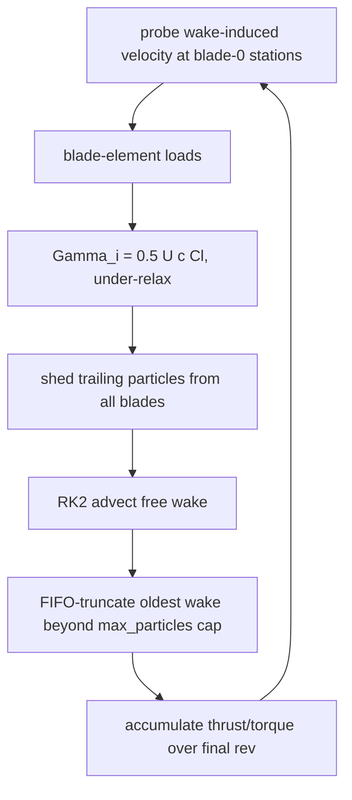

# Vortex Particle Method (VPM) -- design doc

Status: **experimental / in progress**. The wake engine and its unit tests
are implemented. Two rotor couplings exist: a pedagogical axial precursor
and the forward-flight, cyclic- and crosswind-capable coupling (Section
5.5). Neither is yet exposed as a first-class inflow model with the wake
carried as serialized state (Section 6, item 6).

This document describes what is built, the math it implements, the
conventions it follows, its measured performance, and the roadmap. It is
the design reference for anyone extending the VPM path. For the BEM /
Pitt-Peters / Oye models and the shared sign/frame conventions, see
[../AGENTS.md](../AGENTS.md) and [CLAUDE.md](CLAUDE.md).

Math is written in GitHub Flavored Markdown LaTeX (`$...$` inline,
`$$...$$` and ` ```math ` blocks), per the design-document carve-out in
[../AGENTS.md](../AGENTS.md). The surrounding prose stays ASCII (no
em-dashes or smart quotes).

---

## 1. Motivation and scope

The BEM family (quasi-static BEM, Pitt-Peters, Oye) models the rotor inflow
with momentum theory plus empirical regime patches: the Leishman VRS
polynomial, the Ning windmill Brent solver, and the Pitt-Peters wake-skew
L-matrix. These are cheap (~0.1 ms/call) but the wake geometry is never
represented -- it is baked into the inflow model.

The VPM represents the wake explicitly as a cloud of regularized vortex
particles and computes the induced velocity field directly. The motivation
is that several effects the BEM models handle with separate empirical
patches are, in the VPM formulation, consequences of the same wake
convection rather than special cases:

- **Vortex ring state** would arise from wake recirculation rather than
  from an empirical polynomial.
- **Descent / windmill / autorotation** need no separate solver branch; the
  wake convects in whatever direction the induced velocities dictate.
- **Forward-flight wake skew** is geometric (the wake convects downstream)
  rather than an L-matrix off-diagonal.

These are properties of the method, not claims about the present
implementation -- Section 8 is explicit that the descent / VRS regime is
not validated here. The cost is several orders of magnitude more compute
per operating point (Section 7), so the VPM path is aimed at wake-fidelity
questions (VRS, blade-vortex interaction, rotor-rotor / rotor-body
interference), not at replacing the inflow models in trim sweeps.

What VPM still needs from a sectional model: it is inviscid and only
produces the induced velocity field. Sectional $C_l$ / $C_d$ still come from
the same airfoil polar tables as BEM, so stall, reversed flow, and
compressibility remain airfoil-table concerns.

---

## 2. Mathematical formulation

Standard VPM following Winckelmans & Leonard (1993) and the modern
rotorcraft formulation (Alvarez & Ning 2020 / FLOWVPM).

### 2.1 Vorticity discretization

The wake vorticity field is a sum of regularized particles:

$$
\boldsymbol{\omega}(\mathbf{x}) = \sum_p \boldsymbol{\alpha}_p \,
\zeta_{\sigma_p}(\mathbf{x} - \mathbf{x}_p)
$$

- $\boldsymbol{\alpha}_p$ -- particle vector strength, the integral of
  vorticity it carries. Units $\mathrm{m^3/s}$ (circulation times length).
- $\zeta_{\sigma_p}$ -- radially symmetric regularization kernel, core
  size $\sigma_p$.

### 2.2 Regularized Biot-Savart law

$$
\mathbf{u}(\mathbf{x}) = \frac{1}{4\pi} \sum_p g(\rho_p)\,
\frac{\boldsymbol{\alpha}_p \times (\mathbf{x} - \mathbf{x}_p)}{r_p^{\,3}}
$$

with $r_p = |\mathbf{x} - \mathbf{x}_p|$, $\rho_p = r_p / \sigma_p$, and the
low-order algebraic smoothing function

$$
g(\rho) = \frac{\rho^3 \left(\rho^2 + \tfrac{5}{2}\right)}{(\rho^2 + 1)^{5/2}}
$$

(paired with $\zeta(\rho) = \tfrac{15}{8\pi}(\rho^2 + 1)^{-7/2}$). As
$\rho \to \infty$, $g \to 1$ and the singular Biot-Savart law is recovered;
as $\rho \to 0$, $g \sim \tfrac{5}{2}\rho^3$ so the velocity stays finite.

### 2.3 Singularity-free rearrangement (what is evaluated)

The implementation never divides by $r$. Folding $\rho^3 = r^3/\sigma^3$ into
$g/r^3$ gives a kernel that depends only on $\rho^2$ and $\sigma$:

$$
K(\rho, \sigma) = \frac{g(\rho)}{r^3}
= \frac{\rho^2 + \tfrac{5}{2}}{\sigma^3 (\rho^2 + 1)^{5/2}}
$$

$$
\mathbf{u}(\mathbf{x}) = \frac{1}{4\pi} \sum_p K(\rho_p, \sigma_p)\,
\big[\boldsymbol{\alpha}_p \times (\mathbf{x} - \mathbf{x}_p)\big]
$$

Consequences that make this vectorization-friendly:

- $K$ is finite for all $r$, with $K(0, \sigma) = \tfrac{5}{2}/\sigma^3$.
- The self term ($\mathbf{x} = \mathbf{x}_p$) contributes exactly zero
  because $\boldsymbol{\alpha}_p \times \mathbf{0} = \mathbf{0}$. No masks,
  no branches, no division by $r$.
- $(\rho^2 + 1)^{5/2}$ is evaluated as $b^2\sqrt{b}$ with $b = \rho^2 + 1$
  -- one square root, the rest multiplies.

The source particle's own $\sigma$ is used (source-core convention).

### 2.4 Sign convention

A particle strength along $+z$, $\boldsymbol{\alpha} = (0, 0, A)$ with
$A > 0$, induces velocity in $+y$ at a point on the $+x$ axis --
counter-clockwise circulation about $+z$, the right-hand rule for vorticity
along $+z$. This is the sign relation the far-field unit test enforces
(Section 8.1).

The rotor coupling uses the project-wide NED frame and CCW-from-above
convention (see AGENTS.md): hub axis $+Z$, with

$$
\hat{\mathbf{r}}(\psi) = [\cos\psi,\ -\sin\psi,\ 0], \qquad
\hat{\mathbf{t}}(\psi) = [-\sin\psi,\ -\cos\psi,\ 0].
$$

---

## 3. Data structures

The particle field is stored **structure-of-arrays** (SoA), single
precision. Logically it is seven parallel arrays of length `N`, indexed by
particle `p`:

    position   px[p], py[p], pz[p]
    strength   ax[p], ay[p], az[p]     # vector strength alpha_p
    core       sigma[p]

Every per-particle quantity is a pure function of index `p` alone, so all
seven arrays can be read, written, and reduced independently -- the layout
is chosen precisely so that any loop over `p` is a data-parallel map (or
map-reduce) with no cross-particle dependence in the inner kernel.

The field exposes a `particles()` iterator that yields `(pos, strength, sigma)`
tuples for each particle. This is the read path used by the `vpm_viz`
visualiser and any downstream analysis.

Rationale:

- **SoA, not array-of-structs**: a data-parallel kernel over `p` touches
  one component array contiguously, so a width-`W` vector lane consumes `W`
  adjacent particles per step. AoS interleaves components and would force
  gathers, defeating vectorization.
- **f32**: the evaluation is compute-bound and the wake spans meters, so
  single precision is adequate here and roughly doubles vector throughput.
  Many VPM codes run in f64; this choice is local to the engine and
  revisitable. The rest of the codebase is f64.

A scalar f64 reduction of the same sum is retained as the readable
specification and the reference the vectorized path is checked against --
not the hot path.

---

## 4. Numerical methods (implemented)

### 4.1 Velocity evaluation -- direct O(N^2), data-parallel

Given `M` target points and `N` source particles, evaluate the regularized
Biot-Savart sum (Section 2.3) at every target. Self-evaluation (wake on
itself) is the special case where the targets are the source positions.

As a logical operation this is a **map over targets of a reduction over
sources**. The induced velocity at target $t$ is

$$
\mathbf{u}_t = \frac{1}{4\pi} \sum_s K(\rho_{ts}, \sigma_s)\,
\big[\boldsymbol{\alpha}_s \times (\mathbf{x}_t - \mathbf{x}_s)\big],
\qquad \rho_{ts} = \frac{|\mathbf{x}_t - \mathbf{x}_s|}{\sigma_s}
$$

- The outer map over $t$ is independent: targets never interact, so it maps
  onto both levels of CPU data-parallelism -- vector lanes within a core
  (x86 AVX, ARM64 NEON/SVE) and separate cores across the loop -- with no
  synchronization.
- The inner reduction over $s$ is a sum, hence associative -- it may be
  reassociated freely into lane-wise partial sums that are combined at the
  end (this is what lets $W$ sources be processed per vector step).
- The kernel $K$ is branch-free and finite for all separations (Section
  2.3), and the self term contributes exactly zero, so the reduction needs
  no masking or special-casing of $t = s$.
- The source count is padded up to a multiple of the vector width with
  inert particles (zero strength, unit core) so the tail of the reduction
  needs no scalar remainder path; inert particles add exactly zero.

The only floating-point subtlety is that the lane-wise reassociation gives
results that differ from a strict left-to-right scalar sum at the rounding
level; the scalar f64 reduction (Section 3) is the reference this is
checked against.

### 4.2 Time integration -- RK2 (midpoint)

One convection step of the free wake, freestream $\mathbf{U}_\infty$, step
$dt$, with $\mathbf{u}_\text{ind}(\cdot)$ the evaluation of Section 4.1:

```math
\begin{aligned}
\mathbf{u}_1 &= \mathbf{u}_\text{ind}(\mathbf{x}) \\
\mathbf{x}_\text{mid} &= \mathbf{x} + \tfrac{1}{2}\,dt\,(\mathbf{u}_1 + \mathbf{U}_\infty) \\
\mathbf{u}_2 &= \mathbf{u}_\text{ind}(\mathbf{x}_\text{mid}) \\
\mathbf{x} &\leftarrow \mathbf{x} + dt\,(\mathbf{u}_2 + \mathbf{U}_\infty)
\end{aligned}
```

Both velocity evaluations are the data-parallel map of Section 4.1; the
position updates are an elementwise (per-particle) parallel map. Strengths
are held constant (convection only -- stretching and diffusion are not
modelled yet, Section 6).

---

## 5. Rotor coupling I -- axial free-wake precursor (example)

The axial precursor is a minimal, standard lifting-line free-wake coupling
used to sanity check VPM thrust/torque against BEM. It is the pedagogical
precursor to the module in Section 5.5; it is retained because its
trailing-only, axisymmetric structure isolates the trailed-wake
contribution.

### 5.1 Scope and simplifications (all standard for a first coupling)

- **Axial flow only** -- no cyclic, azimuthally symmetric loading.
- **Trailing vorticity only** -- at steady state $d\Gamma/dt \to 0$, so the
  shed (temporal) vorticity vanishes and the trailed (radial-gradient)
  vorticity is the whole wake. This is the classic free-tip-vortex wake
  (Landgrebe / Bagai-Leishman) discretized as particles.
- **Lifting-line loads** via Kutta-Joukowski: $\Gamma = \tfrac{1}{2} U c\,C_l$.
- **Near-wake self-induction only** -- no bound-vortex self term (standard
  for a straight lifting line).

Shared infrastructure: the radial grid (r_mid, chord, twist per station),
the airfoil polar table (Cl/Cd interpolation), and the VPM velocity
evaluation and RK2 advection routines (Sections 4.1-4.2).

### 5.2 Per-step algorithm



Blade-element step (station $i$, azimuth $\psi_0$), with
$U = \sqrt{U_a^2 + U_t^2}$:

```math
\begin{aligned}
\mathbf{v}_\text{air} &= \mathbf{U}_\infty + \mathbf{u}_\text{ind},
   \quad \mathbf{U}_\infty = [0,\,0,\,v_\text{climb}] \\
\mathbf{v}_\text{blade} &= \omega r\,\hat{\mathbf{t}}(\psi_0) \\
\mathbf{U}_\text{rel} &= \mathbf{v}_\text{air} - \mathbf{v}_\text{blade} \\
U_a &= \mathbf{U}_\text{rel}\cdot\hat{\mathbf{z}}
   \quad (\text{axial, } +Z) \\
U_t &= -\,\mathbf{U}_\text{rel}\cdot\hat{\mathbf{t}}
   \quad (\text{tangential, along } -\hat{\mathbf{t}}) \\
\phi &= \mathrm{atan2}(U_a,\, U_t) \\
\alpha &= (\theta_\text{coll} + \theta_{\mathrm{tw},i}) - \phi \\
(C_l, C_d) &= \text{polar}(\alpha) \\
dL &= \tfrac{1}{2}\rho U^2 c\,C_l\,dr, \qquad
dD = \tfrac{1}{2}\rho U^2 c\,C_d\,dr \\
dT &= dL\cos\phi - dD\sin\phi \\
dQ &= (dL\sin\phi + dD\cos\phi)\,r \\
\Gamma_i &= \tfrac{1}{2} U c\,C_l
\end{aligned}
```

Trailing shed (edge $j = 0 \ldots n$, both blades; $\Gamma = 0$ outside the
blade):

```math
\begin{aligned}
\Gamma_{\mathrm{trail},j} &= \Gamma_{j-1} - \Gamma_j \\
\mathbf{s}_j &= \big(-\omega\, r_\text{edge}\,\hat{\mathbf{t}}
   + v_\text{climb}\,\hat{\mathbf{z}}\big)\,dt \\
\boldsymbol{\alpha}_j &= \Gamma_{\mathrm{trail},j}\,\mathbf{s}_j
   \quad \text{at } r_\text{edge}\,\hat{\mathbf{r}}(\psi)
\end{aligned}
```

The tip edge carries $\Gamma_\text{tip}$ (the tip vortex, strongest); the
root edge carries $-\Gamma_\text{root}$.

### 5.3 Convergence and truncation

- Bound circulation is under-relaxed:
  $\Gamma \leftarrow \Gamma + \text{relax}\,(\Gamma_\text{new} - \Gamma)$.
- Wake is FIFO-truncated to
  $N_\text{wake\,rev} \cdot N_\text{steps/rev} \cdot N_\text{shed/step}$
  particles (drop oldest).
- The rotor is marched 8 revolutions; thrust/torque are averaged over the
  final revolution.

### 5.4 Default parameters

| Parameter | Value |
|---|---|
| stations | 20 |
| steps per rev | 24 (15 deg) |
| wake age retained | 4 revs |
| core size sigma | 0.18 m |
| relaxation | 0.35 |
| total revs | 8 |
| implicit lifting-line | on |
| tip clustering (cosine) | on |
| local core sizing | on |

Steady-state particle count $N \approx 2 \cdot 21 \cdot 24 \cdot 4 = 4032$.

---

## 5.5 Rotor coupling II -- unsteady forward-flight free-wake (library)

The forward-flight coupling is an unsteady lifting-line free-wake coupling
(in the spirit of Leishman 2006, ch. 10; Bagai & Leishman 1995) that
supports cyclic pitch and arbitrary in-plane (edgewise / crosswind) inflow.
It removes the two structural restrictions of Section 5 -- azimuthal
symmetry and steady bound circulation -- while reusing the same radial-grid
/ polar-table geometry and the VPM engine.

### 5.5.1 State and time-march

The rotor is marched at fixed azimuthal step $d\psi = 2\pi / N_\psi$,
$dt = d\psi / \omega$. Each blade $b$ sits at
$\psi_b(n) = n\,d\psi + b\,\tfrac{2\pi}{N_b}$. The carried state (`VpmRotorState`) has
three fields:

- **`wake`** -- the shared free-wake particle field (`Option<ParticleField>`).
- **`gamma`** -- the previous-step relaxed bound circulation
  $\Gamma_i^{\,n-1}$ per blade, needed for the shed term.
- **`psi`** -- the current blade-0 azimuth (rad), accumulated across
  `step_one` calls so each call sheds particles from the correct rotor
  position rather than always restarting at $\psi = 0$.
  `march` always starts at $\psi = 0$ and ignores this field.

The solution sought is the **periodic** limit cycle, not a fixed point: loads
are phase-averaged over the final revolution once the wake has settled
($N_\text{settle\,rev}$ revolutions of spin-up).

### 5.5.2 Sectional aerodynamics -- implicit lifting-line (per blade, per step)

The bound circulation is the solution of a **nonlinear (Prandtl) lifting-line
matching problem**, solved implicitly each step. The induced velocity a
section sees is split into two parts:

- a **far field** $\mathbf{u}_\text{far}$ -- the shed particle wake from all
  previous steps, evaluated once per step (Section 4.1) and **frozen**
  during the solve;
- a **near field** $\mathbf{u}_\text{near}(\Gamma)$ -- the trailing vortex
  sheet just behind the blade, linear in the current-step circulation
  $\Gamma$ (Section 5.5.3).

With $U = \sqrt{U_a^2 + U_t^2}$ and

$$\mathbf{u}_\text{ind} = \mathbf{u}_\text{far} + \mathbf{u}_\text{near}(\Gamma):$$

```math
\begin{aligned}
\mathbf{v}_\text{air} &= \mathbf{U}_\infty + \mathbf{u}_\text{far} + \mathbf{u}_\text{near}(\Gamma)
   \quad (\mathbf{U}_\infty = \text{3D hub-frame freestream}) \\
\mathbf{v}_\text{blade} &= \omega r\,\hat{\mathbf{t}}(\psi_b) \\
\mathbf{U}_\text{rel} &= \mathbf{v}_\text{air} - \mathbf{v}_\text{blade} \\
U_a &= \mathbf{U}_\text{rel}\cdot\hat{\mathbf{z}}
   \quad (\text{through-disk, } +Z) \\
U_t &= -\,\mathbf{U}_\text{rel}\cdot\hat{\mathbf{t}}
   \quad (\text{in-plane, along } -\hat{\mathbf{t}}) \\
\phi &= \mathrm{atan2}(U_a,\, U_t)
   \quad (\text{inflow angle}) \\
\theta &= \theta_\text{coll} + \theta_{\mathrm{tw},i}
   + \theta_{1c}\cos\psi_b + \theta_{1s}\sin\psi_b
   \quad (\text{cyclic, Section 5.5.4}) \\
\alpha &= \theta - \phi \\
(C_l, C_d) &= \text{polar}(\alpha) \\
\Gamma_i &= \tfrac{1}{2} U c\,C_l
   \quad (\text{Kutta-Joukowski})
\end{aligned}
```

Because $\mathbf{u}_\text{near}$ depends on $\Gamma$ and $\Gamma$ depends on
$\alpha$ (hence on $\mathbf{u}_\text{near}$), the last two lines are a coupled
fixed point. It is solved by relaxed iteration, seeded from the previous
step's circulation:
$\Gamma_i \leftarrow \Gamma_i + \text{relax}\,(\tfrac12 U c\,C_l - \Gamma_i)$,
repeated until $\Gamma$ stops changing (a few tens of iterations at most).
The far field is not re-probed inside the loop, so each iteration is only
the small near-field matrix-vector product plus a polar lookup -- negligible
against the $O(N^2)$ particle evaluation.

Lift comes from the **polar**, so (unlike a thin-airfoil vortex-lattice) the
bound vortex carries no self term; only the *trailing* wake enters
$\mathbf{u}_\text{near}$. This is the classical viscous lifting-line, in the
Bagai-Leishman free-wake / FLOWVPM tradition. Setting
`nonlinear_lifting_line = false` drops $\mathbf{u}_\text{near}$ and reduces
the solve to a single relaxed Kutta-Joukowski pass (the original pointwise
scheme), retained as a baseline.

Why it matters: the tip unloading ("tip loss") is the trailing tip vortex
driving down the local angle of attack. With only the lagged, core-smoothed
particle wake the section never feels its own just-shed trailing vorticity
within the step, so the load does not taper -- the source of the hover
thrust bias in Section 8. The implicit near wake supplies exactly that
within-step downwash, so the roll-off is computed rather than imposed. In
practice this moves the coarse-grid hover bias by a few percent on its own;
cashing in the full taper also needs tip-clustered (cosine) spanwise spacing
plus a core size scaled to the local segment length (`tip_clustering` and
`local_core`). These two compose: a local core is a no-op on a uniform grid
(every segment is the same width), but once the stations cluster at the tip
the shorter tip segments carry proportionally smaller cores that stop
over-smoothing the tip vortex. With both enabled the measured hover bias
falls to under one percent (Section 8).

"Quasi-steady" here means the *section* uses the static polar at the
instantaneous $\alpha$ -- there is no Theodorsen / Leishman-Beddoes
attached-flow lag and no dynamic-stall model. The only unsteadiness carried
is the **wake memory**: shed vorticity plus free convection. At the reduced
frequencies of a 1/rev cyclic input ($k = \omega c / (2 U_\text{tip})$ is
small) the wake response should be the dominant unsteady effect; this is
not adequate for high-$k$ phenomena (blade-vortex interaction pressure
signatures, deep dynamic stall).

### 5.5.3 Wake emission -- trailed and shed vorticity

The near-wake vortex sheet behind a lifting line splits into two
components whose strengths follow from the spanwise and temporal gradients
of bound circulation. Both are emitted each step, one particle per feature:

**Trailed** (streamwise, from $\partial\Gamma/\partial r$). At each radial
edge $j = 0 \ldots n$ ($\Gamma = 0$ outside the blade) the shed-off
circulation is $\Gamma_{j-1} - \Gamma_j$. It is laid down as a filament
aligned with the local relative wind, length $|\mathbf{U}_\text{rel}|\,dt$:

```math
\begin{aligned}
\mathbf{s}_j &= \mathbf{U}_{\text{rel},\,\text{edge}(j)}\,dt
   \quad (\text{edge value = mean of neighbours}) \\
\boldsymbol{\alpha}_j &= (\Gamma_{j-1} - \Gamma_j)\,\mathbf{s}_j
   \quad \text{emitted at } r_\text{edge}(j)\,\hat{\mathbf{r}}(\psi_b)
\end{aligned}
```

The tip edge carries $\Gamma_\text{tip}$ (the tip vortex), the root edge
$-\Gamma_\text{root}$.

**Shed** (spanwise, from $\partial\Gamma/\partial t$). Kelvin's theorem
applied to a material contour enclosing the blade section and its near wake
requires that any change in bound circulation over $dt$ be balanced by an
equal and opposite spanwise vortex deposited into the wake. Per station:

$$
\boldsymbol{\alpha}_{\mathrm{shed},i} = -\left(\Gamma_i^{\,n} - \Gamma_i^{\,n-1}\right) dr\,\hat{\mathbf{r}}(\psi_b)
$$

i.e. a spanwise segment (parallel to the bound vortex) of length $dr$
carrying circulation $-(\Gamma_i^{\,n} - \Gamma_i^{\,n-1})$, emitted at the
station. This term vanishes identically at the axisymmetric steady state of
Section 5, which is why the axial precursor can omit it; it is non-zero and
load-bearing whenever bound circulation varies with azimuth -- every
cyclic or crosswind case.

All emitted particles use a single core size `sigma` and convect with the
free wake (Section 4.2), so the wake skew in forward flight is geometric --
no prescribed skew angle.

**Near-field influence and the one-step handoff.** The same trailed segments
$\mathbf{s}_j$ are what the implicit solve of Section 5.5.2 uses for the
near field $\mathbf{u}_\text{near}$: each edge $j$ carries a straight vortex
filament from $r_\text{edge}(j)\,\hat{\mathbf{r}}$ along $\mathbf{s}_j$ with
circulation $\Gamma_{j-1} - \Gamma_j$, and its regularized Biot-Savart
velocity at the station control points gives the influence coefficients
$\mathbf{B}_{ij}$ (a finite-segment kernel with the same core $\sigma$). The
near-field velocity is then $\mathbf{u}_{\text{near},i} = \sum_j \mathbf{B}_{ij}\,(\Gamma_{j-1}-\Gamma_j)$,
linear in $\Gamma$, so the leg geometry is fixed once per step (from the
frozen far-field relative wind) and the solve iterates only the strengths.

The legs are exactly one convection step long, so they represent *this*
step's trailed vorticity and nothing else. At the end of the step the same
vorticity is emitted as the trailed particle above and convects with the
far wake; next step the leg is regenerated fresh. Each step's trailed sheet
is therefore counted once -- as a near-field filament during its own step,
then as a far-field particle thereafter -- with no double counting at the
handoff.

### 5.5.4 Cyclic pitch

The harmonics $(\theta_{1c}, \theta_{1s})$ come from the same
swashplate-tilt-to-blade-pitch harmonic mapping the BEM models use (with the
rotor's control gain / phase). With the repo default gain 1 / phase 0 this
reduces to $\theta_{1c} = -$`tilt_lon`,
$\theta_{1s} = +$`tilt_lat`, giving the helicopter-standard signs
(`tilt_lon > 0` nose-down, `tilt_lat > 0` roll-right)
verified by the moment-sign tests below.

### 5.5.5 Hub load integration

Summed over blades and stations, then phase-averaged over the final
revolution (AGENTS.md hub-frame convention, thrust along $-Z$):

```math
\begin{aligned}
dT &= dL\cos\phi - dD\sin\phi \\
T &= \sum dT \\
Q &= \sum r\,(dL\sin\phi + dD\cos\phi) \\
M_x &= \sum r\,dT\,\sin\psi \quad (\text{roll-right positive}) \\
M_y &= \sum r\,dT\,\cos\psi \quad (\text{pitch-up positive})
\end{aligned}
```

Blade flapping is not modelled (rigid blade). Hub moments are therefore the
full aerodynamic moments; the flap-hinge frequency-ratio moment reduction
used by the BEM models could be layered on later if a flapping rotor is
needed.

### 5.5.6 Simplifications and validity envelope

- **Rigid blade by default; optional flap + feather DOFs** -- with no
  `FlapProperties` and direct-mechanical pitch the blade is rigid (pitch
  sets local loading directly, no precession), consistent with the BEM
  convention. Per-blade flap and feathering DOFs can be enabled (Section
  5.6); they are off unless the rotor supplies the matching properties.
- **Quasi-steady polar** -- static `Cl/Cd`, no unsteady-airfoil model
  (Section 5.5.2).
- **One-step near wake** -- the implicit lifting-line trailing sheet extends
  one convection step before handing off to particles (Section 5.5.3); a
  longer near-wake zone would sharpen the tip taper but needs a near/far
  aging split.
- **No reversed-flow / full-360 polar** -- the sectional table is not
  extended into the reversed-flow region, so validity is capped at
  moderate advance ratio (retreating-side reverse-flow patch stays small).
- **Tip-clustered spacing, locally scaled core** -- spanwise stations use
  cosine (tip/root) clustering and each shed/trailed feature carries a core
  scaled to its local segment width (`tip_clustering`, `local_core`, both on
  by default; Section 5.5.2). There is still no core spreading or vortex
  stretching in the free wake -- inherited from the engine (Section 6).

Default resolution mirrors Section 5.4; a coarse preset (12 steps/rev, 2
wake revs, 3 settle revs) is used by the acceptance tests.

## 5.6 Rotor coupling III -- per-blade rigid-blade DOFs (flap + feather)

Because the forward-flight coupling is time-marched per blade, blade
structural DOFs can be integrated in lockstep with the wake instead of being
reduced to a static factor (as the BEM path does for flap). Each blade
carries up to four extra states -- flap ($\beta$, $\dot\beta$) and feather
($\theta_f$, $\dot\theta_f$) -- advanced once per sub-step. Both are off
unless the rotor supplies the matching properties, and the rigid path is
unchanged when they are.

**Flap DOF** (`FlapProperties`, enabled by `config.flap_dynamics`). Out-of-
plane rigid flapping about an equivalent hinge, $\beta > 0$ = flap up (tip
toward $-Z$). Two couplings into the wake, both of which only a free-wake
method can represent:

- *Flap-rate AoA damping*: $\dot\beta$ adds $+r\dot\beta$ to the section
  axial velocity, so flapping up lowers the local angle of attack. The
  aerodynamic flap damping thus emerges from the loads -- there is no
  analytical $\gamma/8$ term.
- *Out-of-plane wake geometry*: the blade sits at $z = -r\beta$, so the
  bound line and every shed/trailed particle is deposited at that height;
  the coned/tilted wake falls out naturally.

The integrated ODE is purely structural/inertial, forced by the aero flap
moment $M_\beta$ (the span sum of $r\,dF_z$, already computed in the loads
loop):

$$I_\beta\,\ddot\beta + I_\beta(\Omega^2 + \omega_{NR}^2)\,\beta = M_\beta,$$

advanced with symplectic Euler. $\omega_{NR}$ is the non-rotating flap
frequency (0 = freely hinged, $\nu_\beta = 1$).

**Feather DOF** (`PitchActuation::ServoFlap`, Kaman path). A passive
feathering rotation driven by a trailing-edge servo-flap. In servo mode the
swashplate collective/cyclic are reinterpreted as flap deflection commands
$\delta_f$; the flap's pitching moment $M_\text{servo}$ drives feathering,
and $\theta_f$ **replaces** the direct swashplate-to-pitch path in the
section angle of attack. Feathering has no centrifugal stiffening (spanwise
axis) and, with the Kaman axis at the aerodynamic centre, no aerodynamic
pitch damping -- so the mechanical bearing damper $C_\theta$ is the only
dissipation and the pushrod/linkage control stiffness $k_\text{ctrl}$ is the
restoring moment:

$$I_\theta\,\ddot\theta_f + C_\theta\,\dot\theta_f + k_\text{ctrl}\,\theta_f
= M_\text{servo},$$

integrated semi-implicitly (implicit on the damper) for unconditional
stability regardless of damper stiffness. $M_\text{servo}$ is accumulated
over the flap span from the true local dynamic pressure. With
$k_\text{ctrl} = 0$ the DC response is singular, so the VPM falls back to the
direct-pitch path.

Both DOFs share the per-blade state vector and compose (a flapping,
feathering blade tilts its wake *and* changes its pitch). The flap harmonics
this produces are compared against classical theory in Section 8.4.

---

## 6. Not yet implemented (next steps, priority order)

1. **Exploit the independent target loop across cores** -- the map over
   targets (Section 4.1) has no cross-target dependence, so on top of the
   per-lane vectorization already in place it can be spread across CPU
   cores. The same independence is what the vector ISAs exploit within a
   core (x86 AVX, ARM64 NEON/SVE), so the two levels compose. Expect close
   to linear speedup with core count until the evaluation becomes
   memory-bound.
2. **Vortex stretching** $d\boldsymbol{\alpha}/dt = (\boldsymbol{\alpha}\cdot\nabla)\,\mathbf{u}$ -- needed for 3D
   circulation conservation once the wake distorts. The algebraic kernel has
   an analytic velocity gradient; add it as a second accumulator.
3. **Viscous diffusion** (core spreading or PSE) so long-lived hover/VRS
   wakes do not stay artificially coherent.
4. **Reversed-flow full-360 polar** -- extend the sectional polar to the
   retreating/reversed-flow region for high advance ratio.
5. **Promote the coupling to a first-class inflow model** with the wake as
   carried, serialized state, registered in the model factory alongside the
   BEM / Pitt-Peters / Oye models and exposed through the Python bindings.

Done since first draft: shed (temporal) vorticity and forward-flight cyclic
+ crosswind coupling (Section 5.5); implicit (Prandtl) lifting-line with the
trailing near-wake solved within each step (Section 5.5.2); tip-clustered
(cosine) spanwise spacing and locally scaled core sizing, which together
close the residual hover thrust bias (Section 8); a monopole Barnes-Hut
O(N log N) evaluator (`induced_at_points_bh` / `advect_rk2_bh`) for when N
outgrows the direct path -- see Section 7.1; `ParticleField::particles()`
iterator for downstream wake access; `VpmRotor::step_one(fc, state, dt)`
for per-frame animation stepping with correct `psi` accumulation across
calls (the `psi` field in `VpmRotorState` was added to fix a bug where
all new particles were shed at azimuth 0 when calling `step_one` repeatedly);
`vpm_viz/` standalone egui/eframe visualiser showing the 30-deg crosswind
wake animated in real time (top-view XY + side-view XZ, viridis colormap
by log10 vorticity magnitude). Per-blade rigid-blade DOFs -- flap
($\beta$, $\dot\beta$) and servo-flap feathering ($\theta_f$,
$\dot\theta_f$) -- integrated in the azimuth march (Section 5.6), with the
flap harmonics checked against classical theory (Section 8.4).

---

## 7. Performance (measured, release)

Direct O(N^2) evaluation, vectorized eight sources per lane. The `parallel`
feature is enabled by default; the outer target loop runs via Rayon
(`par_iter_mut` over targets). Sequential (`induced_velocities_seq`) and
parallel (`induced_velocities`) paths are measured back-to-back with the
same binary (`bh_profile N 0 10 seq|par`). Speedup saturates near the
core count once the per-target work exceeds the Rayon dispatch overhead
(crossover around N=1,000–2,000 on a 4-core laptop).

| N | seq [ms] | par [ms] | par speedup |
|---:|---:|---:|---:|
| 500 | 1.5 | 2.4 | 0.6x (overhead dominates) |
| 2,000 | 23.1 | 15.3 | 1.5x |
| 5,000 | 149 | 64 | 2.3x |
| 10,000 | 574 | 193 | 3.0x |
| 20,000 | 2,288 | 693 | 3.3x |

Scaling follows the expected O(N^2) in both columns; the parallel column
additionally shows the Rayon speedup approaching ~3.3x (4-core machine,
bandwidth-limited above that). All figures are velocity-eval wall-clock
(`bh_profile`, 10 s measurement window, min-noise run).

For reference, the per-step cost of each model at a non-axial operating point
(forward 12 m/s + 5 m/s edgewise crosswind) on the same machine. In a
time-domain simulation you call a BEM-family model once per integration step
(it returns a converged answer, 30 elem x 72 psi), whereas one VPM step
advances the free wake by one azimuth increment (an O(N^2) Biot-Savart probe
+ RK2 advect over the whole cloud):

| Model | cost / step | vs Oye |
|---|---:|---:|
| Oye (annular 2-stage filter) | 0.153 ms | 1x |
| Pitt-Peters (3-state L-matrix) | 0.165 ms | ~1.1x |
| Quasi-static BEM | 19.9 ms | ~130x |
| VPM free-wake, direct seq (run-avg march, N up to ~7,900) | ~0.47 s | ~3.1 x 10^3 |
| VPM free-wake, direct par (run-avg march, N up to ~7,900) | ~0.15 s | ~1.0 x 10^3 |
| VPM free-wake, Barnes-Hut theta=0.5 (full-cloud step, N~7,900) | ~0.04 s | ~260x |

BEM-family rows are release-mode single-core (per-call min). The direct VPM
seq row is a `simulate(fc, dt, n_steps)` at the default resolution
(max_particles=4800, 20 stations) marching 168 steps single-core:
79.7 s (min of 3), ~0.47 s/step. The direct par row scales that by the
~3x Rayon speedup at N≈8,000 (Table 7.0): ~25 s total, ~0.15 s/step. The
average understates the steady-state step because the wake grows from empty
to the ~7,900-particle cap over the first ~4 revs.

The Barnes-Hut row is the expensive end-of-march step at N≈8,000. Each
velocity eval costs ~19.5 ms (seq, Section 7.1); RK2 = two evals plus
advection overhead → ~0.04 s. The BH path benefits from Rayon at ~1.6x
(Section 7.1), giving a par step ~0.025 s. The tree engages only above
`bh_min_particles` and is off by default, so the direct par row is the
normal operating figure; a tree-enabled march would stay near ~0.04 s/step
for full-cloud steps.

Oye and Pitt-Peters are within ~10% of each other; both evaluate a fixed set
of algebraic inflow relations per (element, azimuth). The quasi-static BEM is
~130x slower because each (element, azimuth) station runs an iterative
root-finder (Brent) on the momentum / blade-element balance, and non-axial
wind makes it worse, not better: the swept azimuth exposes more sections to
the turbulent-wake / reversed-flow branches where the solver has to iterate,
so the per-call cost rises above its axial figure rather than falling. The
VPM is ~3 orders of magnitude beyond even the BEM per step (and ~5 orders per
converged operating point): it is not an inflow model but a wake-fidelity
tool that resolves the actual wake geometry, paying the O(N^2) particle cost
at every one of the ~170 marched steps.

**Per operating point** the gap is larger still: the BEM-family models are
already converged after one step, while the VPM needs the full ~170-step
march to reach a periodic wake -- Pitt-Peters ~0.17 ms vs the VPM (direct
par) at ~25 s, roughly 1.5 x 10^5 x. The direct seq figure (79.7 s,
~5 x 10^5 x) is the single-core baseline; Rayon parallel is now the default
and cuts that by ~3x at operating N, with the Barnes-Hut tree (Section 7.1)
changing the N scaling itself -- ~20x at N=8,000 vs seq direct (seq BH
19.5 ms vs seq direct 387 ms), widening with N.

Simulation guidance (bench rotor, omega=120, one rev = 52 ms): a
Tier-A config (~1,200 particles, 24 steps/rev, 3 revs) costs ~2–3 ms/step
with Rayon parallel (3.3x under the single-core ~7 ms), comfortably
faster than real time on 4+ cores. A Tier-B config (~4,300 particles,
36 steps/rev, 4 revs) is ~35–40 ms/step with parallel, a near-real-time
offline setting.

### 7.1 Barnes-Hut tree evaluator (O(N log N))

**Why the tree is faster (the physical picture).** In the direct evaluation
every particle induces a velocity on every other particle. With $N$ particles
that is $N \times N$ pairwise Biot-Savart evaluations: double the size of the
wake and the work quadruples. Most of that work is spent on particles that
are far apart, and there the detail is wasted -- a compact clump of vortex
particles seen from far away induces very nearly the same velocity as a
*single* vortex carrying the clump's total strength, because the regularized
kernel's far field is just the ordinary Biot-Savart law of the net
circulation ($K \to 1/r^3$ once $r \gg \sigma$). The tree exploits this: it
sorts the wake into a nested hierarchy of boxes, and when it evaluates the
velocity at a point it sums the *nearby* vorticity particle-by-particle (where
the detail matters) but replaces each *distant* box with one equivalent
lumped vortex (where it does not). Each evaluation point only ever has to
touch a handful of near particles plus a modest number of far lumps -- a count
that grows like $\log N$ rather than $N$ -- so the total cost grows like
$N \log N$ instead of $N^2$. The bigger the wake, the more this pays off (see
the table below: ~8x faster at 4,000 particles, ~40x at 16,000).

How "far enough to lump" is decided is the one knob: a box is treated as a
single lumped vortex when it looks small from the evaluation point, i.e. when
its width divided by its distance is below the opening angle `theta`. Smaller
`theta` lumps less aggressively (more boxes summed in full) -- more accurate,
slower; larger `theta` lumps more -- faster, coarser. `theta ~ 0.5` keeps the
approximation error to a few percent of the peak velocity.

The direct evaluator above is O(N^2). For large wakes there is a
monopole Barnes-Hut path (`induced_at_points_bh`, `induced_velocities_bh`,
`advect_rk2_bh`) that groups distant sources into a single super-particle
and evaluates the far field with the *same* SIMD kernel as a real particle
-- the regularized kernel's far field is the singular Biot-Savart law
($K \to 1/r^3$ for $r \gg \sigma$), so a far cell is just a source carrying
the lumped strength $\sum \boldsymbol{\alpha}$ placed at the
$|\boldsymbol{\alpha}|$-weighted cell centre with a representative core size.
The tree is flattened into a compact pre-order node array with escape
pointers (no child arrays, no recursion in the walk), and the particles are
reordered at build time into leaf-contiguous, eight-padded blocks. Per target
the stackless walk runs the SIMD kernel directly over each accepted near
leaf's packed block -- there is no per-target near-field gather -- while the
accepted far cells are batched into one small padded buffer and kernelled in
a single tail pass. Traversal is O(N log N) of light scalar work; the heavy
arithmetic stays vectorized.

Precisely, a cell of width $s$ seen at distance $d$ is accepted as far when
$s / d < \theta$, so `theta = 0` lumps nothing and recovers the exact direct
sum. The opening angle is exposed through `VpmRotorConfig` (`barnes_hut`,
`bh_theta`, `bh_min_particles`) and is **off by default** -- the direct sum
is the reference path; the tree engages only when `barnes_hut` is set and the
wake reaches `bh_min_particles` (below that the tree-build overhead is not
worth it). A dipole term could be added later for more accuracy at a given
`theta`.

Measured direct O(N^2) vs tree (`theta = 0.5`) on the profiler's wake-like
cloud (`bh_profile <N> 0|0.5 10 seq|par`, release, 10 s measurement windows).
All four combinations measured back-to-back on the same machine state. The
direct path scales near-linearly with cores (3.1–3.4x at N=4k–16k). The BH
path also benefits from Rayon but less so (1.6–1.75x): all threads share the
same flat-tree node array, which fits in L3 at these sizes, so L3 read
bandwidth becomes the bottleneck once ~2 threads saturate it. The parallel
BH path uses `par_chunks_mut(64)` (64 targets per Rayon task) to amortise
dispatch overhead while keeping the per-thread `Scratch` buffer warm:

| N | direct seq [ms] | direct par [ms] | par speedup | tree seq [ms] | tree par [ms] | par speedup |
|---:|---:|---:|---:|---:|---:|---:|
| 4,000 | 96.8 | 38.0 | 2.5x | 27.8 | 17.3 | 1.6x |
| 8,000 | 386.9 | 124.1 | 3.1x | 60.1 | 37.9 | 1.6x |
| 16,000 | 1,595.6 | 466.7 | 3.4x | 151 | 86.3 | 1.75x |

The direct columns scale cleanly O(N^2) (each doubling ≈ 4x); the tree column
grows ~1.8x per doubling (close to O(N log N)); the direct-vs-tree speedup
widening with N means the tree pays off more the larger the wake. The absolute
ms figures are machine/session specific, but the par speedup and tree speedup
ratios are consistent between runs.

---

## 8. Validation status

### 8.1 Unit tests (all passing)

- **Far field** matches $A / (4\pi d^2)$ within 1%, direction $+y$ for $+z$
  vorticity.
- **Self-induction** of a lone particle is zero.
- **Vectorized vs reference**: the vectorized path matches the f64 scalar
  reference on a random cloud to $< 10^{-3}$ relative.
- **Vortex-ring self-propagation**: a thin ring self-propagates along its
  axis within 30% of the Kelvin thin-core speed
  $U = \dfrac{\Gamma}{4\pi R}\left[\ln\dfrac{8R}{a} - \dfrac{1}{4}\right]$,
  transverse velocity negligible.
- **Advection**: one RK2 step convects a ring downstream.
- **Barnes-Hut vs direct**: the monopole tree (`theta = 0.5`) matches the
  direct sum to $< 5\%$ of peak velocity on a random cloud, converges to the
  direct result as `theta -> 0`, and its RK2 advect step moves a thin ring
  downstream to within 5% of the direct integrator.

### 8.2 Thrust/torque vs BEM (axial precursor)

Rotor R=1 m, 2 blades, collective 8 deg, omega=120 rad/s.

| Regime | BEM thrust [N] | VPM thrust [N] | delta |
|---|---:|---:|---:|
| hover | 215.6 | 238.2 | +10.5% |
| climb +3 | 183.2 | 199.9 | +9.1% |
| climb +6 | 143.4 | 159.2 | +11.0% |
| descent -3 | 533.4 | 230.5 | -56.8% |
| descent -6 | 407.9 | 375.6 | -7.9% |

Read:

- **Hover and climb agree to ~10%**, with the correct trend (thrust falls
  as climb rate rises). The consistent +10% bias has a plausible
  explanation: BEM has Prandtl tip-loss on (this axial precursor does not),
  plus coarse azimuth resolution, a hand-picked `sigma`, and no within-step
  self-induction -- all pushing the same way. Read as a consistency check
  this is about what one would expect from a correctly wired coupling; it is
  not an accuracy claim, and the ~10% is not decomposed into those
  contributions. The forward-flight module (Section 5.5) adds the implicit
  lifting-line self-induction the precursor lacks: on a comparable hover case
  (24 steps/rev) it lowers the analogous bias from about +12% (pointwise) to
  about +9% (uniform lifting-line). Adding tip-clustered (cosine) spanwise
  spacing plus a locally scaled core closes the rest -- the two levers
  compose (a local core does nothing on a uniform grid, but once the spacing
  clusters at the tip it stops over-smoothing the tip vortex), bringing the
  measured hover bias to under +1% (216.5 N vs a 214.9 N BEM anchor).
- **Descent diverges**, in the regime where BEM switches to its empirical
  VRS/windmill model (descent -3 has descent/v_h ~ 0.55, inside the 0-2 VRS
  band; BEM thrust spikes and its torque goes negative = windmilling). VPM
  gives a smooth, finite result with torque approaching zero (which is what
  autorotation would look like) at descent -6 -- but see the caveat.

**Caveat:** the VPM descent numbers are not validated. The trailing-only
wake, 4-rev truncation, and coarse resolution under-resolve the
recirculating VRS wake. Descent here means "the two methods diverge in the
regime where BEM is empirical", not "VPM is right there". Hover and climb
are the comparisons worth trusting; descent is not.

### 8.3 Forward-flight coupling (acceptance tests, all passing)

These are the acceptance tests for the Section 5.5 module. They are run at
the coarse resolution preset (Section 5.5.6), so they assert **directional /
qualitative** physics (signs, monotonicity, boundedness) rather than tight
quantitative agreement -- the quantitative anchor is the axial reduction.

- **Axial reduction**: with zero cyclic and zero in-plane wind the shed
  term vanishes and the model must collapse onto the axial case -- hover
  thrust within 30% of the quasi-static BEM, and hub moments
  $|M_x|, |M_y| < 0.10\,T R$ (axisymmetry). This is the one quantitative
  check and the regression guard on the coupling wiring.
- **Collective**: $dT/d(\text{collective}) > 0$.
- **Longitudinal cyclic**: `tilt_lon > 0` $\Rightarrow M_y < 0$ and
  $|M_y|$ grows from the hover baseline (correct cyclic phasing / hub-moment
  sign).
- **Lateral cyclic**: `tilt_lat > 0` $\Rightarrow M_x > 0$.
- **Crosswind**: 8 m/s edgewise inflow -- thrust stays finite and positive,
  torque finite, the advancing/retreating asymmetry develops a non-zero hub
  moment, and the wake centroid convects downstream ($x_\text{centroid} > 0$).
  This exercises the shed term and the free wake-skew, and guards against the
  numerical blow-up that a wrong-signed shed contribution would produce.

**Not yet covered:** a fully trimmed rotor at a published advance ratio,
the reversed-flow regime, and any BVI-sensitive case. Forward-flight rotor
lift against measured data *is* now checked (Section 8.4); trimmed hub
moments and the reversed-flow regime are not.

### 8.4 Agreement with standard rotor theory

Beyond the internal BEM cross-check (8.2) and the directional acceptance
tests (8.3), the VPM is compared against two external standards: measured
forward-flight data and classical closed-form rotor theory. These are the
"VPM vs standard theory" checks the model is held to.

**Forward-flight autorotation loads vs Wheatley & Hood NACA TR-515.**
`tests/vpm_forward_flight_empirical` (Rust) marches the free-wake PCA-2
autogiro rotor to a periodic state at four measured operating points
(Tables III/IV) and compares the rotor lift coefficient $C_L$ against the
wind-tunnel values. Rigid blades (flap dynamics off) to isolate the wake
model:

| Point | mu | alpha (deg) | CL VPM | CL meas | err |
|---|---:|---:|---:|---:|---:|
| T3_mu018 | 0.181 | 11.2 | 0.364 | 0.363 | 0.1% |
| T3_mu025 | 0.249 | 6.6  | 0.180 | 0.192 | 6.3% |
| T3_mu033 | 0.315 | 4.3  | 0.107 | 0.116 | 8.1% |
| T4_mu024 | 0.242 | 6.3  | 0.218 | 0.266 | 17.9% |

$C_L$ agrees with measurement to within ~8% up to mu = 0.32; the largest
error (T4, higher rpm) sits at the edge of the simplified-geometry envelope
(uniform chord, no twist, linear polar). This is the one
quantitative-vs-measured anchor for the wake model in forward flight.

**Rigid-flap harmonics vs classical flapping theory.**
`examples/vpm_flapping_vs_theory` fits the flap response

$$\beta(\psi) = a_0 - a_1\cos\psi - b_1\sin\psi$$

from the VPM flap DOF (Section 5.6) and compares against the
centrally-hinged ($\nu_\beta = 1$)
closed forms (Bramwell / Seddon / Prouty),

$$a_0 = \gamma\left[\tfrac{\theta_0}{8}(1+\mu^2) - \tfrac{\lambda}{6}\right],
\quad
a_1 = \frac{2\mu(\tfrac{4}{3}\theta_0 - \lambda)}{1 - \mu^2/2},
\quad
b_1 = \frac{\tfrac{4}{3}\mu\,a_0}{1 + \mu^2/2},$$

with Lock number $\gamma = \rho\,a\,c\,R^4 / I_\beta$ and the theory's inflow
$\lambda$ taken from the VPM's own thrust (Glauert) so the comparison is
apples-to-apples on inflow. Rotor $\gamma = 8.4$, collective 8 deg, angles
in degrees:

| mu | a0 VPM | a0 theory | a1 VPM | a1 theory | b1 VPM | b1 theory |
|---:|---:|---:|---:|---:|---:|---:|
| 0.10 | 6.79 | 6.85 | 1.84 | 1.91 | 0.40 | 0.91 |
| 0.15 | 6.99 | 7.45 | 2.87 | 2.99 | 0.30 | 1.47 |
| 0.20 | 6.99 | 7.87 | 3.94 | 4.11 | 0.31 | 2.06 |
| 0.25 | 6.89 | 8.23 | 5.06 | 5.26 | 0.18 | 2.66 |
| 0.30 | 6.74 | 8.58 | 6.33 | 6.45 | -0.10 | 3.29 |

Read:

- **Coning $a_0$** matches within 1% at mu = 0.1. At higher mu the VPM stays
  flat (~6.9 deg) while the closed form climbs to 8.6 deg -- the theory's
  $(1+\mu^2)$ growth assumes uniform inflow and no reverse flow, both of
  which flatten the real coning. The VPM captures that; the closed form
  cannot.
- **Longitudinal flapping $a_1$** (the dominant blowback harmonic) matches
  theory to within ~5% across mu = 0.1-0.3. This validates the flap ODE, the
  aerodynamic flap-moment forcing, and the ~90 deg flap phase lag in one
  shot -- the disk tilts back by the right amount.
- **Lateral flapping $b_1$** is much smaller in the VPM (near zero) than in
  uniform-inflow theory (up to 3.3 deg). $b_1$ is the harmonic most sensitive
  to the lateral inflow distribution, which the uniform-inflow closed form
  gets wrong -- but the measured Wheatley phase (~100-120 deg, i.e. a
  non-trivial lateral component) suggests the VPM currently *under-predicts*
  $b_1$ rather than merely correcting the theory. Open item (see 8.5).

### 8.5 Validation status at a glance

What is and is not checked today. "Validated" = compared against BEM,
measured data, or closed-form theory with the agreement quantified above;
"directional" = sign/trend/stability only; "not validated" = no dedicated
check yet.

| Item | Status | Notes |
|---|---|---|
| Biot-Savart kernel (far field, self-term, SIMD vs f64 ref) | validated | 8.1, < 0.1% |
| Vortex-ring self-propagation | validated | within 30% of Kelvin speed |
| Barnes-Hut vs direct sum | validated | < 5% of peak at theta = 0.5 |
| Axial thrust/torque vs BEM (hover, climb) | validated | ~10% consistency (8.2) |
| Forward-flight coupling signs / trends | directional | acceptance tests (8.3) |
| Forward-flight CL vs measured (Wheatley TR-515) | validated | <= ~8% to mu 0.32 (8.4) |
| Flap coning $a_0$ vs theory | validated | within 1% at low mu (8.4) |
| Flap longitudinal $a_1$ vs theory | validated | within ~5% (8.4) |
| Flap lateral $b_1$ vs theory / measured | NOT validated | VPM under-predicts; needs digitized Wheatley data |
| Flap DOF coning / hub-moment relief | directional | sign + inequality tests |
| Feathering DOF (servo-flap) response | directional | zero/collective/cyclic sign tests; no measured anchor |
| Descent / VRS regime | NOT validated | under-resolved recirculating wake (8.2 caveat) |
| Reversed-flow region (high mu) | NOT validated | no dedicated check |
| Absolute hub moments (quantitative) | NOT validated | trend-only so far |
| Trimmed forward-flight loads | NOT validated | no trim closure yet |
| BVI-sensitive cases | NOT validated | not attempted |

---

## 9. Integration points with the codebase

- Frame / sign conventions: NED, CCW-from-above -- see AGENTS.md. The
  coupling's r_hat / t_hat match the shared BEM kinematics.
- Geometry / polars: `VpmRotor<P: Polar>` is generic over the polar type (same
  pattern as `PittPetersModel<P>`, `OyeBEMModel<P>`, `QuasiStaticBEM<P>`).
  The Python-side `VpmRotor()` factory dispatches to `_VpmRotorLinear` or
  `_VpmRotorTabulated` based on the polar instance, matching the BEM factory
  pattern.
- When promoted to a first-class model (Section 6, item 6): the wake becomes
  carried, serialized inflow state, and the model is registered in the model
  factory alongside the others and exposed through the Python bindings.

---

## 10. References

- Winckelmans, G. and Leonard, A. (1993). "Contributions to Vortex Particle
  Methods for the Computation of Three-Dimensional Incompressible Unsteady
  Flows." J. Comput. Phys. 109(2), pp. 247-273.
  DOI: [10.1006/jcph.1993.1216](https://doi.org/10.1006/jcph.1993.1216)
  -- the algebraic regularization kernel.
- Cottet, G.-H. and Koumoutsakos, P. (2000). "Vortex Methods: Theory and
  Practice." Cambridge University Press. ISBN 978-0-521-62 178-3.
  -- general VPM theory, stretching, diffusion.
- Alvarez, E. J. and Ning, A. (2020). "High-Fidelity Modeling of Multirotor
  Aerodynamic Interactions for Aircraft Design." AIAA J. 58(10), pp. 4385-4400.
  DOI: [10.2514/1.J059178](https://doi.org/10.2514/1.J059178)
  -- reformulated VPM / FLOWVPM, modern rotorcraft usage.
- Leishman, J. G. (2006). "Principles of Helicopter Aerodynamics," 2nd ed.
  Cambridge University Press. ISBN 978-0-521-85860-1.
  -- lifting line, Kutta-Joukowski, VRS, tip vortices.
- Bagai, A. and Leishman, J. G. (1995). "Rotor Free-Wake Modeling using a
  Pseudo-Implicit Technique -- Including Comparisons with Experimental Data."
  J. American Helicopter Society 40(3), pp. 29-41.
  DOI: [10.4050/jahs.40.29](https://doi.org/10.4050/jahs.40.29)
  -- rotor free-wake conventions.
- Landgrebe, A. J. (1972). "The Wake Geometry of a Hovering Helicopter Rotor
  and its Influence on Rotor Performance." J. American Helicopter Society
  17(4), pp. 3-15.
  DOI: [10.4050/jahs.17.4.3](https://doi.org/10.4050/jahs.17.4.3)
  -- prescribed / trailing wake geometry.

---

## 11. Gaps for RAWES application

RAWES (`c:\repos\windpower`) is a tethered 4-blade autorotating rotor kite. The rotor disk
is tilted ~67 deg from vertical at the nominal operating point (disk tilt from wind ξ ≈ 29 deg;
tether elevation β ≈ 8 deg); it operates in continuous autorotation with no engine, and the
pumping cycle alternates between a reel-out (climbing, windmill, power-generating) phase and a
reel-in (descending, reduced-power) phase. The production sim uses `dynbem quasi_static` BEM at
400 Hz; the VPM would be an optional higher-fidelity path for specific operating-point analysis,
not a real-time drop-in. What needs to change before VPM produces useful results for RAWES:

### 11.1 Autorotation / windmill torque balance

The RAWES rotor runs in **autorotation**: net shaft torque is zero (or slightly positive to
reel-in drag). The current VPM marches at a fixed `omega_rad_s` from `FlightCondition`; it does
not close the torque balance. For a meaningful autorotating operating point the caller needs to
drive omega to the zero-torque equilibrium, either by running an outer Newton iteration over
`omega_rad_s` until `VpmRotorResult.torque == 0`, or by coupling the VPM to the omega_spin ODE
from `windpower/simulation/dynamics.py` through the `AeroModel::step` interface.

The windmill quadrant (negative `v_climb`, advancing-tip regime, where BEM switches to the
Ning/Brent windmill solver) is present in the quasi-static BEM path but has never been exercised
through the VPM's shedding loop. The VPM's lifting-line solve uses `Kutta-Joukowski + polar`
on every blade element without a separate windmill branch; the polar and circulation solve should
naturally handle windmilling if the inflow angle `phi` goes past 90 deg (rotor acts as turbine),
but this has not been validated. Section 8 explicitly flags the descent/windmill regime as
unvalidated.

### 11.2 Heavily oblique disk tilt (ξ ~ 29-70 deg from wind)

In hover or gentle forward flight the disk is roughly perpendicular to the gravity vector and
the in-plane wind is a small fraction of the tip speed. For RAWES the disk may be tilted up to
~67 deg from vertical (ξ ≈ 29 deg from wind, or steeper during reel-in). The VPM `v_hub` is
already given in hub frame with `v_hub[2]` as axial (through-disk) and `v_hub[0:2]` as
in-plane, so the frame decomposition is correct for any tilt. What is NOT validated:

- **High advance ratio**: RAWES tip speed ~52 m/s at 270 RPM; 10 m/s wind at ξ ≈ 29 deg gives
  in-plane component ~5 m/s → mu ≈ 0.10. This is modest. At reel-in tilt (ξ ≈ 55-70 deg) the
  in-plane component grows to ~8-9 m/s → mu ≈ 0.15-0.18, which is within the validated range
  of the crosswind tests but at the upper end.
- **Near-axial reversed flow on the retreating side** has not been tested at these advance
  ratios. The lifting-line solve uses a static polar with no reversed-flow extension (Section
  5.5.6); if retreating-blade AoA exceeds stall, the polar will clip but not diverge.
- **Tether attachment below the disk plane**: the tether hangs below the hub. At steep tilt the
  tether direction is nearly in-plane with the disk. This affects the force balance (the net
  aerodynamic force must balance tether tension + gravity component) but does not change the
  rotor aerodynamics internally; it is a coupling issue, not a VPM model issue.

### 11.3 Nonlinear SG6042 airfoil polar

The RAWES blade uses the **SG6042** low-Reynolds-number airfoil (Re ~ 127,000 at 50% span,
10 m/s wind). This is a cambered, low-Re profile with:
- Non-zero CL0 (zero-lift angle ≈ -4.92 deg)
- Nonlinear Cl vs alpha above ~8 deg
- Pronounced laminar separation bubble and hysteresis near stall
- Thin blade (10% thickness) -- different Cl_alpha slope from NACA profiles

The VPM currently uses a `LinearPolar` (constant Cl_alpha, symmetric stall). SG6042 at
operating Re requires a tabulated `XFoilPolar` or XFLR5 polar (Cl, Cd, Cm vs alpha at the
relevant Re range). `VpmRotor<P: Polar>` is now generic over the polar type (same as the
BEM-family models), so passing a `TabulatedPolar` works directly -- no internal re-sampling
step. The polar also needs to cover at least +-20 deg to handle the large AoA excursions in
autorotation.

### 11.4 Kaman servo-flap pitch actuation

The RAWES blades use a **Kaman-type trailing-edge servo flap** for pitch control
(`PitchActuation::ServoFlap` in `dynbem_rs`). The VPM currently only exercises
`PitchActuation::DirectMechanical`. The servo-flap path:
- Introduces a first-order feathering lag (~90 deg phase at 1/rev)
- Attenuates high-frequency cyclic authority
- Requires the `ServoFlapActuation` / `ServoFlapGeometry` parameters from the RAWES YAML
  (`beaupoil_2026.yaml`)

The VPM's `march_window` passes `fc.collective_rad`, `fc.tilt_lon`, `fc.tilt_lat` through
`cyclic_coeffs` as direct swashplate commands. To use `ServoFlap` actuation the VPM would
need to call the servo-flap dynamics at each azimuthal step alongside the existing
lifting-line solve, rather than mapping tilt directly to blade pitch. This is
`dynbem_rs::servoflap` already exists for the BEM-family models; it needs wiring into the
VPM's inner blade loop.

### 11.5 Variable omega coupling to the spin ODE

RAWES omega evolves in time as a state variable (`omega_spin` ODE in `dynamics.py`). The VPM
`FlightCondition.omega_rad_s` is a fixed parameter per call. For proper coupling the caller
must update `omega_rad_s` each step from the physics ODE. The `AeroModel::step` interface in
`dynbem_rs` already supports this (it rebuilds `FlightCondition` from `RotorInputs` each call),
but VPM's `step()` advances by a fixed number of azimuthal sub-steps derived from the
**current** omega, so a large omega change mid-simulation will alter the real-time advancement
rate. This is acceptable provided the VPM step interval is small relative to the spin
acceleration timescale (which it is: one sub-step = 20 deg at 18 steps/rev, ≈ 4 ms at 270 RPM).

### 11.6 Integration cadence alignment (RESOLVED)

`VpmRotorConfig` no longer carries any timestep concept. The sub-step duration
is the caller's `dt`, passed directly into `step()`, `march()`, and `simulate()`:

- `step(inputs, state, dt)` -- one sub-step per call; `dpsi = omega * dt`.
  Pass your controller loop `dt` (e.g. 1/400 s) and psi accumulates exactly.
- `march(fc, warm, dt, n_steps)` -- settle for `n_steps` sub-steps of `dt`;
  loads averaged over the second half. Caller computes
  `n_steps = round(settle_s / dt)`.
- `simulate(fc, dt, n_steps)` -- convenience wrapper around `march()`.

`VpmRotorConfig` is now purely model fidelity: `max_particles`, `sigma`,
`relax`, and the lifting-line / clustering / Barnes-Hut flags.

**Removed fields:** `n_steps_per_rev`, `n_wake_rev`, `n_settle_rev`, `dt_step_s`.
**New field:** `max_particles: usize`.

### 11.7 State serialization

The RAWES simulation uses `to_dict()` / `from_dict()` on all state objects for
checkpointing (e.g. `steady_state_starting.json`). `VpmRotorState` carries a
`ParticleField` (SoA of f32 arrays) and a `gamma` matrix; neither is currently
serializable. For the VPM to be a drop-in for the `dynbem` factory, its state needs
`get_inflow()` / `set_inflow()` that round-trips through a flat vector, or alternatively a
bespoke `to_dict()` that serializes the raw particle arrays to JSON/binary.

### 11.8 Non-inertial hub acceleration

The RAWES hub orbits the tether anchor at ~0.105 rad/s with radius ~15 m → centripetal
acceleration ≈ 0.16 m/s^2 (≈ 1.7% g). The VPM treats the hub as inertially fixed; blade
element inertial corrections for hub acceleration are not modelled and are below the accuracy
target at current orbit rates, but would matter if the orbit radius or rate increases.

### Priority order for RAWES integration

| Priority | Item |
|----------|------|
| 1 | Tabulated SG6042 polar (Section 11.3) -- affects every operating point |
| 2 | Zero-torque autorotation omega iteration (Section 11.1) -- needed for any valid OP |
| 3 | ~~Cadence decoupling~~ (Section 11.6 -- DONE: caller dt drives step/march) |
| 4 | ServoFlap wiring into VPM inner loop (Section 11.4) -- needed for control realism |
| 5 | Validated windmill / reel-in regime (Section 11.1) -- only needed for reel-in analysis |
| 6 | State serialization (Section 11.7) -- needed for checkpointing/factory drop-in |
