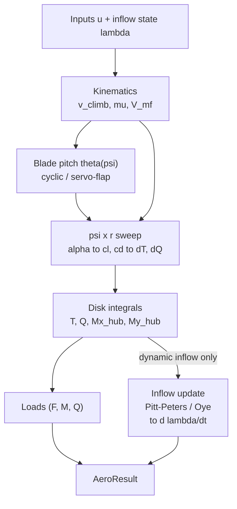

# BEM Common Design Reference

This document covers shared BEM infrastructure: coordinate system, kinematics,
the BEM force kernel, QS BEM solver, VRS correction, servo-flap, output assembly,
blade flapping, the inflow integrator, numerical floors, model comparison, and
validation summary.

Model-specific design notes live in:
- [PITT_PETERS_DESIGN.md](PITT_PETERS_DESIGN.md) -- Pitt-Peters 3-state dynamic inflow
- [OYE_DESIGN.md](OYE_DESIGN.md) -- Oye 2-stage annular dynamic inflow
- [VPM_DESIGN.md](VPM_DESIGN.md) -- VPM free-wake solver

---

The architecture is a blade-element momentum (BEM) solver with replaceable
dynamic-inflow sub-models, all sharing a common azimuth-radial sweep kernel.

---

## System Overview

The model is a map from rotor inputs and the current inflow state to the
aerodynamic loads and the time-derivative of the inflow state. The
derivative is integrated externally (the trim/envelope drivers), closing
the dynamic-inflow loop across time steps.

$$\big(\mathbf{u},\; \boldsymbol{\lambda}\big) \;\longmapsto\; \big(\mathbf{F},\,\mathbf{M},\,Q,\; \dot{\boldsymbol{\lambda}}\big)$$

QuasiStatic and the dynamic-inflow models split at the disk integrals.
**QuasiStatic** has no inflow state: each element's inflow ratio
$`\lambda_r`$ is converged inside the sweep itself, so it only contributes
to the loads. **Pitt-Peters / Oye** carry an inflow state, so the disk
integrals feed a steady-state target that sets the state derivative
$`\dot{\lambda}`$, which the external integrator advances between calls.
The VRS empirical correction overrides the uniform-inflow target inside
the Pitt-Peters / Oye inflow update when in the recirculating-wake regime.

---

## 1. Coordinate System

**NED (North-East-Down)** throughout, without exception:

| Axis | Direction |
|------|-----------|
| +X   | North     |
| +Y   | East      |
| +Z   | Down      |

Gravity acts in the **+Z** direction. Rotor thrust (upward) is
`F_world[2] < 0`. The rotor spins **counter-clockwise (CCW) when viewed
from above** (American convention: Bell / Sikorsky / Boeing).

### Azimuth and Hub Frame

Azimuth psi is measured from the +X (hub forward) axis, increasing in
the direction of blade motion (CCW from above):

$$\hat{r}(\psi) = [\cos\psi,\; -\sin\psi,\; 0]^\top$$

$$\hat{t}(\psi) = [-\sin\psi,\; -\cos\psi,\; 0]^\top \quad \text{(direction of blade tip velocity)}$$

The **advancing side** is at +Y (East) in forward flight along +X.

---

## 2. Kinematics

Called once per `compute_forces` invocation. Shared by all three models
(`bem_common::kinematics`).

Given rotor speed $\Omega$ (rad/s), tip radius $R$, hub rotation matrix
$`\mathbf{R}_\text{hub}`$, vehicle velocity $`\mathbf{v}_\text{hub}`$, and
wind $`\mathbf{v}_\text{wind}`$ (all in NED):

$$\mathbf{v}_\text{rel} = \mathbf{v}_\text{wind} - \mathbf{v}_\text{hub}$$

$$\hat{h} = \mathbf{R}_\text{hub}\,[0,\,0,\,1]^\top \quad \text{(hub axis in world frame)}$$

$$v_\text{climb} = \mathbf{v}_\text{rel} \cdot \hat{h}$$

$$\mathbf{v}_\text{inplane} = \mathbf{v}_\text{rel} - \hat{h}\,v_\text{climb}$$

$$v_\text{edge} = \|\mathbf{v}_\text{inplane}\|, \qquad \mu = \frac{v_\text{edge}}{\Omega R}$$

$$\mathbf{v}_\text{inplane,hub} = \mathbf{R}_\text{hub}^\top\,\mathbf{v}_\text{inplane}$$

The mass-flow speed at the disk (Glauert mass-flow scalar $V_\text{mf}$):

$$V_\text{mf} = \sqrt{v_\text{edge}^2 + (v_\text{climb} + v_0)^2}$$

where $v_0$ is the axial component of the current induced velocity (m/s).

> **Symbol note.** $V_\text{mf}$ is the resultant flow speed *through* the
> disk used to scale the dynamic-inflow time constants. It is **not** the
> blade tip speed $\Omega R$ and **not** the blade-element tangential
> velocity $v_t = \Omega r + v_{t,\text{extra}}$ of Section 6. In the Rust
> source it is `v_mass_flow_disk` (locals `v_mf`); the tangential velocity
> stays `v_t`. The induced velocity $v_0$ is dimensional (m/s); its
> non-dimensional counterpart is $\lambda_0 = v_0 / \Omega R$.

---

## 3. Cyclic Pitch Mapping

Swashplate tilts (`tilt_lon`, `tilt_lat`) map to blade-pitch Fourier
harmonics via `cyclic_coeffs` (`dynbem_rs/src/cyclic.rs`). With
swashplate phase $\varphi$ and gain $g$ (here $`\eta_\text{lon}`$ $\equiv$
`tilt_lon` and $`\eta_\text{lat}`$ $\equiv$ `tilt_lat`):

$$\theta_{1c} = g\,(-\eta_\text{lon}\cos\varphi - \eta_\text{lat}\sin\varphi)$$

$$\theta_{1s} = g\,(-\eta_\text{lon}\sin\varphi + \eta_\text{lat}\cos\varphi)$$

**Helicopter-standard sign convention**: `tilt_lon > 0` produces nose-down
disk tilt (forward stick); `tilt_lat > 0` produces roll-right.

Per-azimuth blade pitch:

$$\theta(\psi) = \theta_0 + \theta_{1c}\cos\psi + \theta_{1s}\sin\psi$$

where $\theta_0$ is the collective pitch.

---

## 4. Airfoil Polar Interpolation

Both tabulated and analytical polars expose a unified `Polar` trait
(`dynbem_rs/src/polar.rs`). The inner loop calls `polar.cl_cd(alpha)`,
which is a binary-search linear interpolation over sampled angle-of-attack
tables (`PolarTable`). Analytical polars (e.g. flat-plate) are
pre-sampled to 4001 points over $[-\pi/2,\;\pi/2]$ at build time.

---

## 5. Prandtl Tip and Hub Loss

Applied in the quasi-static BEM iteration and Oye's $W_{qs}$ estimate.
Both factors use the same function form (`quasi_static_bem.rs`):

$$F_\text{tip} = \frac{2}{\pi}\arccos\!\left[\exp\!\left(-\frac{N_b}{2}\cdot\frac{1-x}{x\,|\sin\phi|}\right)\right]$$

$$F_\text{hub} = \frac{2}{\pi}\arccos\!\left[\exp\!\left(-\frac{N_b}{2}\cdot\frac{x-x_\text{hub}}{x_\text{hub}\,|\sin\phi|}\right)\right]$$

Combined loss: $F = F_\text{tip}\cdot F_\text{hub}$, floored at
`MIN_LOSS_FACTOR` = $10^{-4}$ to prevent division blow-up at the tip and
root.

Here $`x = r/R`$, $`x_\text{hub} = r_\text{root}/R`$, $`N_b`$ is the blade
count, and $\phi$ is the local inflow angle.

---

## 6. Per-Element BEM Force Kernel

`element_force` (`bem_common.rs`, `#[inline(always)]`): given prescribed
axial velocity $`v_a`$ and tangential velocity $`v_t = \Omega r + v_{t,\text{extra}}`$:

$$\phi = \arctan\!\frac{v_a}{v_t}$$

$$\alpha = \theta(\psi) + \theta_\text{twist}(r) - \phi$$

$$c_n = c_L\cos\phi - c_D\sin\phi, \qquad c_t = c_L\sin\phi + c_D\cos\phi$$

$$q_e = \tfrac{1}{2}\rho\,(v_a^2 + v_t^2)\,c(r)\,\Delta r\,N_b$$

$$dT = q_e\,c_n, \qquad dQ = q_e\,c_t\,r$$

The in-plane tangential wind from forward flight:

$$v_{t,\text{extra}} = v_{x,\text{hub}}\sin\psi + v_{y,\text{hub}}\cos\psi$$

---

## 7. Azimuth-Radial Sweep (psi-loop)

The disk loads are obtained by integrating the element forces over the
rotor disk: $`N_\psi`$ azimuth stations and $`N_r`$ radial annuli. At each
azimuth $\psi$ the per-azimuth blade pitch is

$$\theta(\psi) = \theta_0 + \theta_{1c}\cos\psi + \theta_{1s}\sin\psi$$

and the tangential velocity at element $i$ is
$v_t = \Omega r_i + v_{t,\text{extra}}(\psi)$. Elements in the reverse-flow
region ($v_t \le 0$) contribute zero. The azimuth-averaged disk loads are

$$T = \frac{1}{N_\psi}\sum_\psi\sum_i dT_i(\psi), \qquad
  Q = \frac{1}{N_\psi}\sum_\psi\sum_i dQ_i(\psi)$$

Hub-frame moments from the thrust distribution:

$$M_{x,\text{hub}} = \frac{1}{N_\psi}\sum_\psi \sin\psi\sum_i r_i\,dT_i(\psi), \qquad
  M_{y,\text{hub}} = \frac{1}{N_\psi}\sum_\psi \cos\psi\sum_i r_i\,dT_i(\psi)$$

$`M_x`$ is rolling moment (positive = roll right); $`M_y`$ is pitching moment
(positive = nose up), following the NED right-hand rule. The per-element
$`dT_i`$, $`dQ_i`$ come from each model's inflow law: the prescribed-inflow
models (Pitt-Peters, Oye) evaluate the element kernel of Section 6 with
their local $\lambda$; the QuasiStatic BEM solves the momentum balance of
Section 9 at each element.

---

## 8. Operating Regimes and Sign Conventions

These conventions are shared by **all three models** — the
prescribed-inflow models (Pitt-Peters, Oye) feed
$\lambda_\text{total} = \lambda_\text{climb} + \dots$ through the same
element kernel of Section 6, so the torque and thrust signs below follow
identically.

### 8.1 Climb / descent sign convention

The internal axial freestream is taken as
$v_\text{climb} = \mathbf{v}_\text{rel} \cdot \hat{h}$ with no negation
(see Section 2):

| $`v_\text{climb}`$ | Flow through disk | Regime |
|------------------|-------------------|--------|
| $`> 0`$ | downward | helicopter climb / normal inflow |
| $`= 0`$ | — | hover |
| $`< 0`$ | upward | autorotation / flying wind turbine |

### 8.2 Torque sign and autorotation

The torque sign follows automatically from the inflow sign, with no
special-casing. In autorotation (upward wind, so the net axial inflow
$\lambda < 0$):

$$\lambda < 0 \;\Rightarrow\; \phi < 0 \;\Rightarrow\;
  c_t = c_L\sin\phi - c_D\cos\phi < 0 \;\Rightarrow\; Q < 0$$

A negative aerodynamic torque *drives* the rotor: the external integrator
$\dot{\Omega} = (-Q + Q_\text{motor})/I$ then gives positive angular
acceleration, i.e. the windmilling rotor speeds up until torque balance.
In powered/hover mode ($\lambda > 0$), $Q > 0$ is aerodynamic drag on the
rotor, so $\dot{\Omega} < 0$ without motor torque — the rotor decays
toward rest. The same expression therefore captures both energy-absorbing
and energy-extracting operation.

### 8.3 Thrust direction

$$\mathbf{F}_\text{world} = -T\,\hat{h}$$

$T \ge 0$ for any lift-producing rotor ($c_n > 0$ in both modes). For a
level rotor with $\hat{h} = [0, 0, 1]^\top$ this gives
$F_{\text{world},z} = -T < 0$, i.e. upward thrust in NED, in both
helicopter and turbine operation. (Restated in Section 14, Output
Assembly.)

---

## 9. Quasi-Static BEM

**Description.** The classical blade-element momentum model with no inflow
memory: at every call the local inflow ratio $\lambda_r$ at each
radial annulus is driven to the value that balances blade-element thrust
against annulus momentum. There is no inflow state carried between calls
-- the inflow is whatever the instantaneous geometry and loading demand.

**Advantages.** Numerically robust across the whole envelope (hover,
climb, descent, windmill) thanks to the inflow-ratio formulation and the
dedicated Ning/Buhl turbine branch; no state to integrate, so no
time-step stability constraint and no transient to settle; the only model
that resolves the high-induction turbulent-wake state physically.

**Disadvantages.** No inflow dynamics -- it cannot represent the lag
between a control input and the wake's response, so it is wrong during
fast transients and gives no dynamic-inflow phase shift; per-element
iteration makes it the most expensive per call; inflow is azimuthally
resolved only through the loading, with no explicit harmonic feedback.

`BEMModel` / `solve_bem_element` (`quasi_static_bem.rs`). Each element's
inflow ratio $\lambda_r$ is solved per call via a fixed-point iteration
(up to 60 iterations, tolerance $10^{-7}$):

The local solidity: $\sigma_r = N_b\,c(r)\,/\,(2\pi r)$.

The momentum-BEM quadratic (helicopter mode, $\lambda_\text{climb} = v_\text{climb}/\Omega R$):

$$4F\lambda_r(\lambda_r - \lambda_\text{climb}) = \sigma_r\,c_n\,(\lambda_r^2 + x^2)$$

Rearranged to standard form and solved explicitly; root selected by sign
of $\lambda_\text{climb}$ (climb uses positive root, descent uses negative root).

> **Symbol note.** $\lambda_\text{climb} = v_\text{climb}/\Omega R$ is the
> non-dimensional climb inflow ratio (Rust local `lambda_climb`). Do not
> confuse it with the Pitt-Peters cosine harmonic $\lambda_c$ of Section
> 10 (Rust state field `lambda_c`) -- a different quantity that happens to
> share the bare letter $c$. The two never appear in the same model.

### 9.1 Windmill / turbine solver (Ning 2014 + Buhl 2005)

For the energy-extracting regime (upward axial flow, $v_\text{climb} < 0$)
the helicopter quadratic is replaced by a dedicated windmill solver
working in induction-factor space $(a, a')$. Following Ning (2014), the
coupled induction equations are recast as a single residual in the local
inflow angle $\phi$ and bracketed by Brent's method over
$\phi \in (-\pi/2,\,0)$:

$$g(\phi) = \sin\phi\,(1 + a')\,\lambda_r + \cos\phi\,(1 - a) = 0$$

where $\lambda_r = \Omega r / |v_\text{climb}|$ is the local speed ratio.
For each trial $\phi$ the axial induction comes from momentum-BEM,

$$a = \frac{k}{1 + k}, \qquad k = \frac{\sigma_r\,c_n}{4F\sin^2\phi}$$

**Buhl turbulent-wake correction.** Classical momentum theory predicts a
*decreasing* thrust for $a > 1/2$, which is non-physical — real rotors
keep loading up into the turbulent-wake state. When $a > 0.4$ the solver
switches to Buhl's (2005) empirical thrust law, which is a smooth
parabola in $a$ matched to momentum theory at $a = 0.4$ and to the
measured $C_T \approx 1.6$ near $a = 1$:

$$C_T = \frac{8}{9} + \left(4F - \frac{40}{9}\right)a + \left(\frac{50}{9} - 4F\right)a^2$$

Equating this to the blade-element thrust $C_T = k_2(1-a)^2$ with
$k_2 = \sigma_r c_n / \sin^2\phi$ gives the quadratic actually solved for
$a$:

$$\left(\tfrac{50}{9} - 4F - k_2\right)a^2 + \left(4F - \tfrac{40}{9} + 2k_2\right)a + \left(\tfrac{8}{9} - k_2\right) = 0$$

the physical root being the smaller one in $[0.4,\,1]$. The tangential
induction is $a' = k_t/(1 - k_t)$ with $k_t = \sigma_r c_t / (4F\sin\phi\cos\phi)$,
clamped to $[-\tfrac12, \tfrac12]$.

If no sign-changing $\phi$-bracket exists, or the converged state leaves
the valid windmill regime ($0 < a < 1$, $c_n > 0$), the solver returns
nothing and the element falls back to the helicopter quadratic above.

In the QuasiStatic model the per-element momentum balance is converged
inside the azimuth sweep, so the inflow is self-consistent at every
$(\psi, r)$ rather than prescribed from a stored state.

### 9.1a Extension to Non-Axial Flow (v_t_extra correction)

The Ning 2014 windmill formulation, as used in OpenFAST AeroDyn, was
derived for axial (turbine) operation where in-plane wind is negligible.
In a helicopter or autorotating kite rotor descending at an oblique angle,
however, each blade element has significant tangential velocity from
forward flight: $v_t = \Omega r + v_{t,\text{extra}}(\psi)$ (Section 6).

**The problem with the axial-only residual.** The standard Brent residual

$$g(\phi) = \sin\phi\,(1 + a')\,\lambda_r + \cos\phi\,(1 - a) = 0$$

implicitly assumes $v_t = \Omega r$ only. When $v_{t,\text{extra}}$ is
large (high advance ratio, descent + edgewise wind), the effective local
speed ratio changes at each azimuth station. Without accounting for this,
the Brent solver finds spurious roots near $\phi \approx 0$ where $a \to 1$
-- the solver converges to a non-physical high-induction solution because
it thinks the element is more heavily loaded than it actually is.

**Corrected residual.** The extended windmill residual used in dynbem
carries the extra tangential velocity explicitly. Defining a local speed
ratio that includes in-plane wind:

$$\tilde{\lambda}_r = \frac{\Omega r + v_{t,\text{extra}}}{|v_\text{climb}|}$$

the Brent residual becomes:

$$g(\phi) = \sin\phi\,(1 + a')\,\tilde{\lambda}_r + \cos\phi\,(1 - a) = 0$$

and the element force kernel receives the true tangential velocity
$v_t = \Omega r + v_{t,\text{extra}}$ from the converged $(\phi, a, a')$.

**Natural bracket-existence filter.** Instead of an artificial guard
(`v_edge < |v_climb|` threshold), the corrected solver simply checks
whether the residual changes sign across the bracket
$\phi \in (-\pi/2,\, -\varepsilon)$. If both endpoints have the same sign,
no windmill root exists for this element at this azimuth, and the fallback
to the helicopter quadratic fires. This is physically meaningful:

- At azimuths where forward flight adds to tangential velocity (advancing
  side), the effective speed ratio increases and the windmill root persists.
- At azimuths where $v_{t,\text{extra}}$ opposes $\Omega r$ (retreating
  side, reverse flow), the bracket may close -- the element naturally
  reverts to the helicopter solution.

This extension is unique to dynbem -- OpenFAST's AeroDyn BEMT uses the
windmill solver only in the axial flow path and does not run it inside
an azimuth-resolved psi-loop with in-plane wind. The correction is
necessary for any rotor that windmills in oblique descent (autorotating
kites, autogyros in forward flight, descent with crosswind).

### 9.2 Hover-safe inflow iteration

The standard wind-turbine BEM iterates on the induction factor
$a = v_i / V_\infty$, which is **singular in hover** because
$V_\infty \to 0$. This model instead iterates on the **total inflow
ratio** $\lambda_r = v_a / (\Omega R)$, where $v_a$ is the total axial
velocity at the disk (external freestream + induced). The combined
momentum-BEM relation per annulus, with $k = \sigma_r c_n / (8F)$,
is the quadratic above written as

$$k\,(\lambda_r^2 + x^2) = \lambda_r\,(\lambda_r - \lambda_\text{climb})$$

At hover ($v_\text{climb} = 0 \Rightarrow \lambda_\text{climb} = 0$) this is
non-singular and gives the standard hover solution directly:

$$\lambda_r = x\sqrt{\frac{k}{1 - k}}$$

so a single code path covers hover, climb, descent, and the
windmill/turbine regime without switching variables.

### 9.3 Root selection

The momentum quadratic

$$4Fk(\lambda_r^2 + x^2) - 4F\lambda_r(\lambda_r - \lambda_\text{climb}) = 0
  \;\;\Leftrightarrow\;\;
  4F(k-1)\lambda_r^2 + 4F\lambda_\text{climb}\lambda_r + 4Fkx^2 = 0$$

has two roots:

$$r_{1,2} = \frac{-\lambda_\text{climb} \pm \sqrt{\lambda_\text{climb}^2 - 4(k-1)kx^2}}{2(k-1)}$$

The physical root is selected by the sign of $\lambda_\text{climb}$:

- **Helicopter / hover** ($\lambda_\text{climb} \ge 0$): want $\lambda_r > 0$.
  Prefer the root that is already positive; fall back to the other if neither is.
- **Turbine / autorotation** ($\lambda_\text{climb} < 0$): want $\lambda_r < 0$.
  Prefer the root that is already negative; fall back to the other if neither is.

The fall-back is not just defensive — it is load-bearing near the autorotation
crossing. At the instant the operating point crosses through hover, both roots
are near zero and neither satisfies the sign predicate cleanly; the fall-back
picks the one that is geometrically correct for the current side. Without it
the solver locks onto the wrong branch and produces a thrust/torque discontinuity
as the rotor passes through hover.

**Degenerate cases** handled separately in the code:

- $k \approx 1$ (denominator $2(k-1) \to 0$): the quadratic becomes linear;
  the root is $\lambda_r = -kx^2/\lambda_\text{climb}$ (valid when
  $|\lambda_\text{climb}| > 0$).
- Hover, $\lambda_\text{climb} \approx 0$ *and* $k \approx 1$: the linear
  formula also degenerates; the code falls back to
  $\lambda_r = x\sqrt{k}$, which is the hover actuator-disk result at the
  linear-momentum limit.

---

## 10. Pitt-Peters 3-State Dynamic Inflow

See [PITT_PETERS_DESIGN.md](PITT_PETERS_DESIGN.md) for state equations, L-matrix,
ODE, and steady-state targets, plus implementation notes (sign translation,
mass-flow parameter, wind-axis rotation, VRS notes).

---

## 11. Oye 2-Stage Annular Dynamic Inflow

See [OYE_DESIGN.md](OYE_DESIGN.md) for per-annulus filter states, W_qs
momentum target, two-stage ODE, and what Oye cannot model.

---

makes Pitt-Peters stiff at high advance ratios and in descent + edgewise wind.
For implementation notes (W sign convention, why the axial-momentum form was
rejected, what Oye cannot model) see [OYE_DESIGN.md](OYE_DESIGN.md).
---

## 12. Vortex-Ring State (VRS) Empirical Correction

Applied when: $v_\text{climb} < 0$ (descent) and $0 < \lambda_2 < 2$.

Leishman empirical polynomial (Castles-Gray TN-2474 fit):

$$v_h = \sqrt{\frac{T}{2\rho A}}, \qquad \lambda_2 = \frac{v_\text{descent}}{v_h}$$

$$\frac{\lambda_1}{v_h} = 1 + 1.125\lambda_2 - 1.372\lambda_2^2 + 1.718\lambda_2^3 - 0.655\lambda_2^4$$

In the VRS regime $\lambda_{0,ss}$ is replaced by $\lambda_1/\Omega R$
and the Pitt-Peters cross-coupling terms ($L_\text{off}$) are skipped.
The same override applies across all annuli in the Oye model.

This correction is part of the dynamic-inflow steady-state target, so it
applies only to **Pitt-Peters and Oye**. The QuasiStatic BEM has no VRS
model -- its momentum/windmill solve runs unmodified through the
recirculating-wake regime, where its results are not trustworthy.

---

## 13. Servo-Flap Feathering Model (Kaman rotor)

Source: `dynbem_rs/src/servoflap.rs`. Applies when
`PitchActuation::ServoFlap` is active. The blade feathering angle
$\delta\theta$ is driven by a trailing-edge servo-flap rather than by
direct swashplate connection.

### Equation of Motion (psi-domain)

$$I_\theta\,\delta\theta'' + C_\theta\,\delta\theta' + k_\text{aero}\,\delta\theta = M_\text{servo}(\psi)$$

where primes denote $d/d\psi$, and:

$$k_\text{aero} = \tfrac{1}{2}\rho\,c_{L\alpha}\,c\,x_\text{AC}\,R^3/3 \quad \text{(zero if AC at feathering axis)}$$

### Servo-Flap Aerodynamic Moment

$$M_{f,0} = \delta_{f,0}\,m_\text{dc}, \quad M_{f,1c} = \delta_{f,1c}\,m_\text{dc}, \quad M_{f,1s} = \delta_{f,1s}\,m_\text{dc} + \delta_{f,0}\,m_\mu$$

$$m_\text{dc} = \tfrac{1}{2}\rho\Omega^2 C_{M\delta}\,c\,\frac{r_\text{out}^3 - r_\text{in}^3}{3}$$

$$m_\mu = -\tfrac{1}{2}\rho\Omega^2 C_{M\delta}\,c\,\mu R\,(r_\text{out}^2 - r_\text{in}^2)$$

### 1/rev Harmonic Balance Solve

Frequency ratio: $p^2 = 1 + k_\text{aero}/(I_\theta\Omega^2)$,
mechanical damping ratio: $\zeta = C_\theta/(2 I_\theta \Omega)$.

$$\begin{bmatrix} p^2-1 & 2\zeta \\ -2\zeta & p^2-1 \end{bmatrix}
  \begin{bmatrix} A \\ B \end{bmatrix}
  = \frac{1}{I_\theta\Omega^2}\begin{bmatrix} M_{f,1c} \\ M_{f,1s} \end{bmatrix}$$

$$\det = (p^2-1)^2 + 4\zeta^2$$

For $p^2 = 1$ (feathering axis at AC, pure Kaman design):
$A = -M_{f,1s}/(C_\theta\Omega)$, $B = +M_{f,1c}/(C_\theta\Omega)$.
This is the classical 90-degree phase lag: cosine forcing drives sine
response. No internal phase compensation is applied; the controller must
account for this lag through swashplate phase configuration.

In servo-flap mode, $(\delta\theta_0, A, B)$ **replace** the direct
swashplate-to-pitch path in the psi-loop.

---

## 14. Output Assembly

`assemble_result` (`bem_common.rs`), called by all three models:

$$\mathbf{F}_\text{world} = -T\,\hat{h}$$

$$\mathbf{M}_\text{orbital} = \mathbf{R}_\text{hub}\,[M_{x,\text{out}},\;M_{y,\text{out}},\;0]^\top$$

$$\mathbf{M}_\text{spin} = Q\,\hat{h}$$

`F_world` is the aerodynamic force in NED world frame; `M_orbital` is the
hub-frame aero moment rotated to world frame (hub rolling/pitching moments);
`M_spin` is the reaction torque about the hub axis; `Q_spin` is the scalar
shaft torque.

When blade flapping is configured (Section 14a), the hub moments are reduced
before rotation to world frame:

$$M_{x,\text{out}} = f_\text{hub}\,M_{x,\text{hub}}, \qquad M_{y,\text{out}} = f_\text{hub}\,M_{y,\text{hub}}$$

Otherwise $M_{x,\text{out}} = M_{x,\text{hub}}$ (rigid blade, backward
compatible).

---

## 14a. Quasi-Static Blade Flapping (Hub Moment Reduction)

Source: `FlapProperties` in `dynbem_rs/src/rotor_definition.rs`,
`apply_flap_reduction` in `dynbem_rs/src/bem_common.rs`.

A flexible blade (or one with a flap hinge) absorbs most of the
aerodynamic pitching/rolling moment via out-of-plane deflection. Only the
fraction determined by the blade's flap frequency ratio reaches the
airframe hub. This is modelled as a quasi-static (algebraic) moment
reduction applied after the psi-loop integration and before output
assembly.

### Equivalent Spring-Hinge Model

The blade's out-of-plane flexibility is represented as a virtual hinge
with a torsional spring. The rotating flap frequency ratio:

$$\nu_\beta^2 = 1 + \left(\frac{\omega_\text{NR}}{\Omega}\right)^2$$

where $\omega_\text{NR}$ is the blade's non-rotating first flapwise
natural frequency (from root bending stiffness $K_\beta = I_b\,\omega_\text{NR}^2$)
and $\Omega$ is the rotor speed. The "1" comes from centrifugal
stiffening at the rotating speed.

### Hub Moment Reduction Factor

$$f_\text{hub} = \frac{\nu_\beta^2 - 1}{\nu_\beta^2}$$

| Configuration | $`\omega_\text{NR}`$ | $`\nu_\beta`$ | $`f_\text{hub}`$ | Physical meaning |
|---|---|---|---|---|
| Freely hinged (teetering) | 0 | 1.0 | 0 | No moment transfer to airframe |
| Typical hingeless | $`0.2{-}0.4\,\Omega`$ | 1.02-1.08 | 0.04-0.14 | Blade absorbs 86-96% of moment |
| Very stiff / rigid | $`\gg \Omega`$ | $`\gg 1`$ | $`\to 1`$ | Full moment transfer (legacy behaviour) |

### Where the Reduction is Applied

The reduction acts **only on the output to the airframe**. The Pitt-Peters
inflow ODE (Section 10) still uses the *full* aerodynamic moments
$`(M_{x,\text{hub}}, M_{y,\text{hub}})`$ because the wake responds to disk
loading, not to what the airframe sees. Thrust and torque are unaffected.

This is physically correct: the blade flaps to a new equilibrium angle
that redistributes the aerodynamic reaction between blade inertia
(centrifugal restoring) and hub structure (root bending), but the total
aerodynamic moment on the disk -- which drives the wake -- is unchanged.

### Relation to Attitude Damping

On a rigid-blade rotor, when the airframe pitches at rate $q$, the hub
moment is proportional to the rate (aerodynamic damping from the
asymmetric thrust distribution). With flapping, the blade absorbs most
of this moment -- the effective aerodynamic damping derivative seen by the
airframe is multiplied by $f_\text{hub}$. However, for an articulated or
flexible rotor the *cyclic inflow feedback* (Pitt-Peters $\lambda_c$,
$\lambda_s$) provides additional dynamic damping that is not captured
by this quasi-static factor. The two effects are complementary: the
flap reduces the instantaneous moment transfer while the inflow lag
provides the dynamic (rate-dependent) component.

---

## 15. Semi-Implicit Inflow Integrator and Trim Solver

Source: `dynbem_rs/src/trim.rs`. Generic over any `AeroModel`.

### Why this exists

The dynamic-inflow models return a state *derivative* $\dot{\boldsymbol{\lambda}}$,
not a converged inflow — the caller is responsible for integrating it
forward in time. Two needs follow from this:

- **Numerical stability.** The inflow time constants span a wide range:
  $\tau_0 = 8R/(3\pi V_\text{mf})$ for the uniform state versus the much smaller
  $\tau_{c,s} = 16R/(45\pi V_\text{mf})$ for the harmonics, and both shrink as
  $V_\text{mf}$ grows. At the time steps used by the envelope sweep, explicit
  Euler on the fast states is unstable (the update overshoots and rings).
  A *semi-implicit* step damps each state by its own
  $1/(1 + \Delta t/\tau_i)$ factor, which is unconditionally stable for a
  first-order relaxation regardless of $\Delta t/\tau$, while still
  reducing to explicit Euler for the quasi-static states ($\tau = \infty$).
  This is what lets one fixed-step driver cover hover through high-advance-
  ratio descent without per-regime step tuning.

- **Steady-state trim.** Most validation and envelope points are
  *equilibrium* conditions: the rotor is asked to hold a commanded
  attitude (zero net hub moment, or a prescribed $M_x, M_y$). That
  requires finding the cyclic inputs $(\eta_\text{lon}, \eta_\text{lat})$
  that null the hub moments *after* the inflow has settled. Because the
  inflow and the moments are mutually coupled (cyclic changes the moments,
  which through the L-matrix change the inflow, which changes the
  moments), the trim solver must relax the inflow to quasi-steady state at
  each cyclic guess before measuring the residual — hence the integrator
  and the trim solver live together.

### Semi-Implicit Euler Step

Each inflow state $\lambda_i$ has a time constant $\tau_i$ returned by
`inflow_taus`. The step damps the update by the implicit factor:

$$\lambda_i^{n+1} = \lambda_i^n + \frac{\Delta t\,\dot{\lambda}_i^n}{1 + \Delta t / \tau_i}$$

Quasi-static states ($\tau = \infty$) use explicit Euler (damping factor = 1).

### Cyclic Trim Solver

`solve_trim_cyclic` iterates on `(tilt_lon, tilt_lat)` to drive hub-frame
moments $(M_x, M_y)$ to prescribed targets (typically zero for level flight).
Algorithm:

1. Relax inflow to quasi-steady state at current cyclic guess.
2. Probe numerical Jacobian:
   $\partial M_y / \partial \eta_\text{lon}$ and
   $\partial M_x / \partial \eta_\text{lat}$
   via forward-difference with step `probe_rad`.
3. Newton update (50% under-relaxation) on each axis independently.
4. Repeat until $|M_x|, |M_y| <$ tolerance.

The axes are treated as decoupled (diagonal Jacobian) because the
dominant coupling is $\eta_\text{lon} \to M_y$ and $\eta_\text{lat} \to M_x$;
cross-coupling is small relative to the diagonal terms for modest advance
ratios.

---

## 16. Numerical Floors

All constants in `dynbem_rs/src/common.rs`. These are empirical, tuned to
keep the full operating envelope (hover, climb, descent, VRS, autorotation)
stable in one code path without mode-switching.

| Constant | Value | Role |
|----------|-------|------|
| `EPS_DENOM` | $`10^{-9}`$ | Generic denominator / ratio guard |
| `EPS_OMEGA_R` | $`10^{-6}`$ | Not-spinning threshold |
| `MIN_LOSS_FACTOR` | $`10^{-4}`$ | Prandtl tip+hub loss floor |
| `MASS_FLOW_HOVER_FLOOR_FRAC` | $`10^{-2}`$ | $`V_\text{mf}`$ floor as fraction of $`\max(\Omega R, 1)`$ |
| `VRS_DESCENT_THRESHOLD` | $`10^{-3}`$ | VRS detection guard against hover chattering |
| `MU_T_FLOOR` | $`0.05`$ | L-matrix denominator floor |

---

## 17. Model Comparison Summary

| Property | QuasiStatic BEM | Pitt-Peters | Oye |
|----------|----------------|-------------|-----|
| Inflow states | 0 (converged each call) | 3 global ($`\lambda_0, \lambda_c, \lambda_s`$) | $`2N_r`$ annular ($`W_\text{int}, W`$) |
| Inflow dynamics | None | 3 time constants | Per-annulus $`\tau_1`$, $`\tau_2(r)`$ |
| Cyclic inflow feedback | No | Yes (L-matrix coupling) | No |
| Wake-skew coupling | No | Yes ($`L_\text{off}`$ cross-coupling) | No |
| VRS correction | No (momentum/windmill only) | Yes (Leishman) | Yes (Leishman) |
| Numerical stiffness | Low | High at high $`\mu`$ + descent | Low |
| Hub moment harmonics | Averaged $`\psi`$-loop | Averaged + feedback to inflow | Averaged, no feedback |
| State size | 0 | 3 | $`2N_r`$ |

### 17.1 Operating-Envelope Support

Which model to reach for in each regime. "Preferred" marks the model
best suited to that regime; the others still run but with the caveat
noted.

| Regime | QuasiStatic BEM | Pitt-Peters | Oye |
|--------|-----------------|-------------|-----|
| Hover | OK | OK | OK |
| Axial climb | OK | OK | OK |
| Forward flight, low $`\mu`$ | OK (no inflow lag) | Preferred (cyclic feedback) | OK (no cyclic feedback) |
| Forward flight, high $`\mu`$ | OK | Stiff (small $`\Delta t`$) | Preferred (stable) |
| Descent + edgewise wind | OK | Stiff / can destabilise | Preferred (stable) |
| Vortex-ring state | Not modelled (no VRS override) | Leishman empirical | Leishman empirical |
| Autorotation / windmill | Preferred (Ning/Buhl solver) | Sign-of- $`\lambda`$ only | Sign-of- $`\lambda`$ only |
| Fast control transients | Not modelled (no inflow state) | Preferred (3-state lag) | OK (annular lag, no cyclic) |

Notes:

- **VRS**: only Pitt-Peters and Oye apply the Leishman empirical
  $\lambda_1$ override (Section 12). QuasiStatic has no recirculating-wake
  model -- its momentum/windmill solve is used unmodified, so results in
  the vortex-ring state are not trustworthy.
- **Autorotation / windmill**: only QuasiStatic has the dedicated
  Ning 2014 / Buhl 2005 turbine solver (Section 9.1) that resolves the
  high-induction turbulent-wake state. Pitt-Peters and Oye reach the
  energy-extracting regime purely through the sign of their prescribed
  inflow (Section 8.2) -- correct in torque sign but without the
  turbulent-wake thrust correction.
- **Transients**: QuasiStatic carries no inflow state, so it cannot
  represent the lag between a control input and the wake response; use a
  dynamic-inflow model when the time history matters.

---

## 18. Validation

The models are validated on two fronts: against **published experimental
rotor data** (absolute accuracy and qualitative correctness), and against
**independent open-source BEM / dynamic-inflow codes** (implementation
cross-checks). Each dataset has a verifier script under
[`verification/`](../verification/) and a regression test under
[`tests/`](../tests/); the source-paper extractions live under `Research/`.
Full provenance, per-dataset bias analysis, and convention-reconciliation
notes are in [EMPIRICAL_VALIDATION.md](EMPIRICAL_VALIDATION.md).

### 18.1 Against experimental data

All four experimental datasets are hover/axial or autorotation rotors;
the Level-1 BEM here is inviscid and incompressible with a tabulated
polar, so the consistent picture is **correct structure** (monotonicity,
sign flips, autorotation crossing, inflow shape) with a **systematic
high bias on absolute** $`C_T`$ that grows with tip Mach and shrinks with
solidity.

| Dataset (paper) | Regime | Quantity | BEM error | Test |
|---|---|---|---|---|
| Castles-Gray, NACA TN-2474 | Hover (Table I, 11 pts) | $`C_T`$ | +11% mean, 11% RMSE | [test_castles_gray.py](../tests/test_castles_gray.py) |
| Castles-Gray, NACA TN-2474 | Hover (Table I, 11 pts) | $`\Delta C_Q`$ | -1.5% mean, 14% RMSE | [test_castles_gray.py](../tests/test_castles_gray.py) |
| Castles-Gray, NACA TN-2474 | Vertical descent | $`Q`$ sign flip / autorotation crossing | sign correct | [test_castles_gray.py](../tests/test_castles_gray.py) |
| Castles-Gray, NACA TN-2474 | Windmill-brake (Fig 12) | $`\lambda_1(\lambda_2)`$ inflow shape | within 20% | [test_castles_gray.py](../tests/test_castles_gray.py) |
| Caradonna-Tung, NASA TM-81232 | Hover | $`C_T`$ | +30-45% | [test_bem_components.py](../tests/test_bem_components.py) |
| Caradonna-Tung, NASA TM-81232 | Hover | $`C_T`$ ratios | within ~10% | [test_bem_components.py](../tests/test_bem_components.py) |
| Caradonna-Tung, NASA TM-81232 | Hover (151-pt sweep) | spanwise $`C_\ell`$ | median 31% (tip ~10-20%) | [test_caradonna_spanwise.py](../tests/test_caradonna_spanwise.py) |
| Harrington, NACA TN-2318 | Hover (full-scale Re) | $`C_T`$ | +30-45% | [test_bem_components.py](../tests/test_bem_components.py) |
| Wheatley-Hood, NACA TR-515 (PCA-2) | Forward-flight autorotation ($`\mu = 0.13-0.72`$, 286 pts) | $`C_Q`$ residual at autorotation | mean $`C_Q \approx -0.0011`$ (trimmed), all rows < 0 | [test_wheatley_autorotation.py](../tests/test_wheatley_autorotation.py) |

The Wheatley-Hood PCA-2 set is the only forward-flight autorotation
benchmark and the most extensive (286 validated operating points). The
persistent negative $`C_Q`$ residual is attributed to the rigid-blade BEM
not reproducing flapping-induced angle-of-attack relief on the advancing
side. The Buhl (NREL/TP-500-36834) windmill quadratic and the Peters
(JAHS 2009) L-matrix are **formulation** sources, not data — their
correctness is checked structurally (right root chosen, off-diagonal
sign, wake-skew response) rather than to a tolerance.

**Origin of the systematic $`C_T`$ bias** (detailed in
[EMPIRICAL_VALIDATION.md](EMPIRICAL_VALIDATION.md)): inviscid +
incompressible BEM (no tip-Mach correction on $`C_{L\alpha}`$); polar-vs-test
Reynolds mismatch; Prandtl tip-loss under-prediction at low aspect ratio;
geometric uncertainty in the source rotors; source-scan extraction
quality. The bias is largely multiplicative, which is why ratios between
operating points track within ~10% even when absolute $`C_T`$ is 30-45%
high. The pattern is stable across three independent hover experiments
spanning Re 200k-2M and $`M_\text{tip}`$ 0.25-0.88.

### 18.2 Against other BEM / dynamic-inflow codes

These cross-checks isolate the algorithm from the data: dynbem and the
reference code are given the same geometry, polar, and operating point,
so agreement to a few percent confirms the BEM implementation itself.
The reference codes run in Docker (see the `*_docker/` folders under
[`verification/`](../verification/)) and their outputs are committed as CSVs
so the tests stay deterministic.

| Reference code | Rotor / regime | Quantity | Agreement | Test / verifier |
|---|---|---|---|---|
| **CCBlade** (NREL/WISDEM) | NREL Phase VI HAWT, 21 pts, $`V = 5-25`$ m/s | $`C_T`$ / $`C_Q`$ | CT max 2.3%, CQ max 2.9% | [test_dynbem_vs_ccblade.py](../tests/test_dynbem_vs_ccblade.py) |
| **CCBlade** (NREL/WISDEM) | Beaupoil RAWES rotor, 25 pts | $`C_T`$ / $`C_Q`$ | CT max 1.8%, CQ max 11% (at autorotation crossing) | [test_dynbem_vs_ccblade.py](../tests/test_dynbem_vs_ccblade.py) |
| **XROTOR** | Caradonna-Tung, pure hover (5/8/12 deg) | thrust | three-way vs paper + XROTOR | [dynbem_qsbem_vs_xrotor_caradonna_tung.py](../verification/dynbem_qsbem_vs_xrotor_caradonna_tung.py) |
| **OpenFAST AeroDyn** (DBEMT_Mod=1) | NREL Phase VI, Oye dynamic inflow | $`C_T`$ / $`C_Q`$ | same-algorithm cross-check | [dynbem_oye_vs_openfast_nrel_phase_vi.py](../verification/dynbem_oye_vs_openfast_nrel_phase_vi.py) |
| **AeroDyn** (polar lookup) | NREL Phase VI, per-element $`(\alpha)`$ | $`C_\ell`$ / $`C_d`$ interpolation | to a few ULPs | [dynbem_polar_vs_aerodyn_nrel_phase_vi.py](../verification/dynbem_polar_vs_aerodyn_nrel_phase_vi.py) |

Notes:

- **CCBlade / NREL Phase VI** is the cleanest cross-check — that rotor is
  exactly the envelope CCBlade was built for. Both BEMs agree within ~3%
  at every operating point. dynbem reaches the windmill regime through its
  own Ning-2014 Brent's-method solver with Buhl turbulent-wake correction
  (Section 9.1), not a fixture flag.
- **CCBlade / Beaupoil** stresses a cambered-airfoil helicopter-style
  rotor at zero pitch; the only large relative error (11% $`C_Q`$) is at
  the autorotation crossing where the absolute torque is ~$`2\times10^{-5}`$
  and relative error inflates near zero.
- **XROTOR** provides the hover peer check that AeroDyn cannot (its
  wind-turbine BEM is singular at $`V_\infty = 0`$); XROTOR's free-tip
  potential formulation handles static thrust natively.
- **OpenFAST AeroDyn DBEMT** and dynbem's Oye model implement the *same*
  2-stage annular dynamic-inflow algorithm, so residual differences
  isolate implementation choices (mass-flow term, $`W_{qs}`$
  linearisation, hover floor, tip-loss form) rather than physics.
- Convention reconciliation (pitch-to-stall vs pitch-to-feather sign, NED
  wind direction, torque-sign in energy-extraction mode) is handled inside
  each verifier and documented in its header.

---

## 19. References

- Peters, D.A. (2009). *How Dynamic Inflow Survives in the Competitive
  World of Rotorcraft Aerodynamics: The Alexander Nikolsky Honorary
  Lecture.* JAHS 54(1):011001. (`Research/Peters_Nikolsky_2008/`)
- Oye, S. (1990). *A simple vortex model.* IEA Symposium on the
  Aerodynamics of Wind Turbines.
- Snel, H. & Schepers, J.G. (1995). *Joint investigation of dynamic
  inflow effects and implementation of an engineering method.* ECN-C--94-107.
- OpenFAST AeroDyn Theory v3.5, Section 6.3.4 (DBEMT).
- Leishman, J.G. (2000). *Principles of Helicopter Aerodynamics.*
  Cambridge University Press.
- Castles, W. & Gray, R.B. (1951). *Empirical relation between induced
  velocity, thrust, and rate of descent of a helicopter rotor.* NACA TN-2474.
- Ning, A. (2014). *A simple solution method for the blade element
  momentum equations with guaranteed convergence.* Wind Energy 17(9):1327-1345.
- Buhl, M.L. (2005). *A new empirical relationship between thrust
  coefficient and induction factor for the turbulent windmill state.*
  NREL/TP-500-36834.
- Bramwell, A.R.S. (1976). *Helicopter Dynamics.* Arnold.
